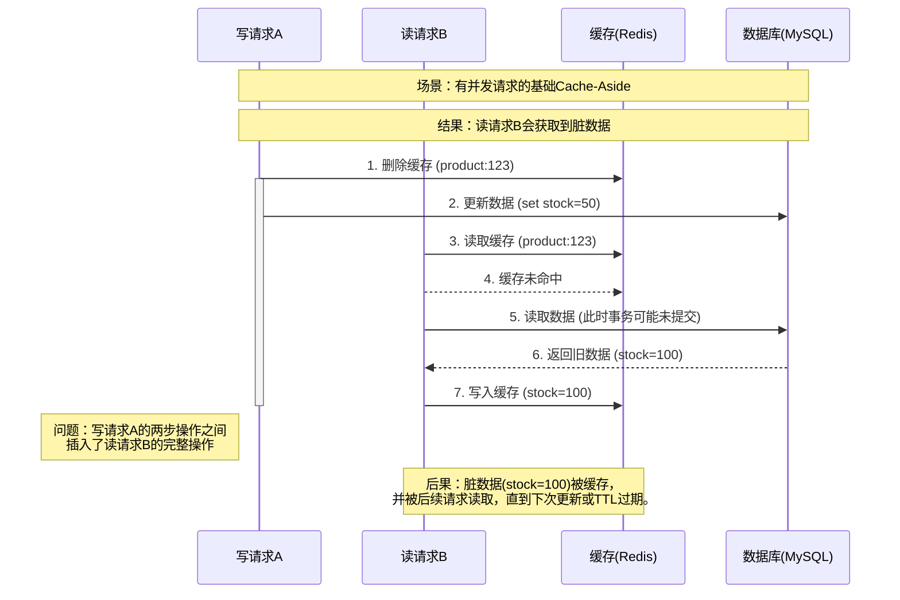
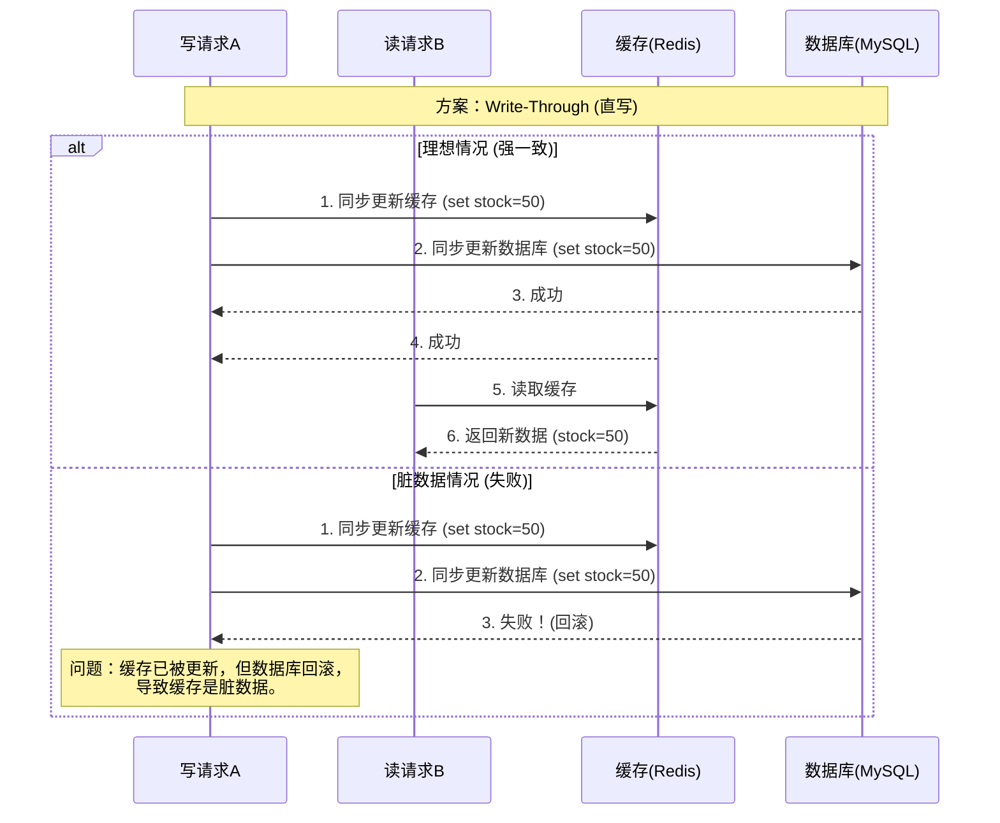
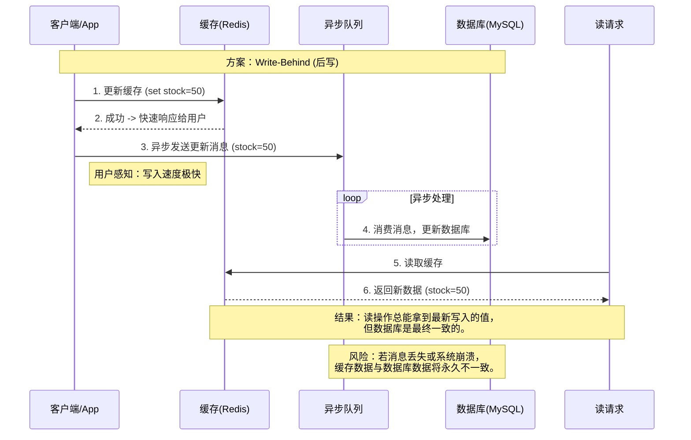
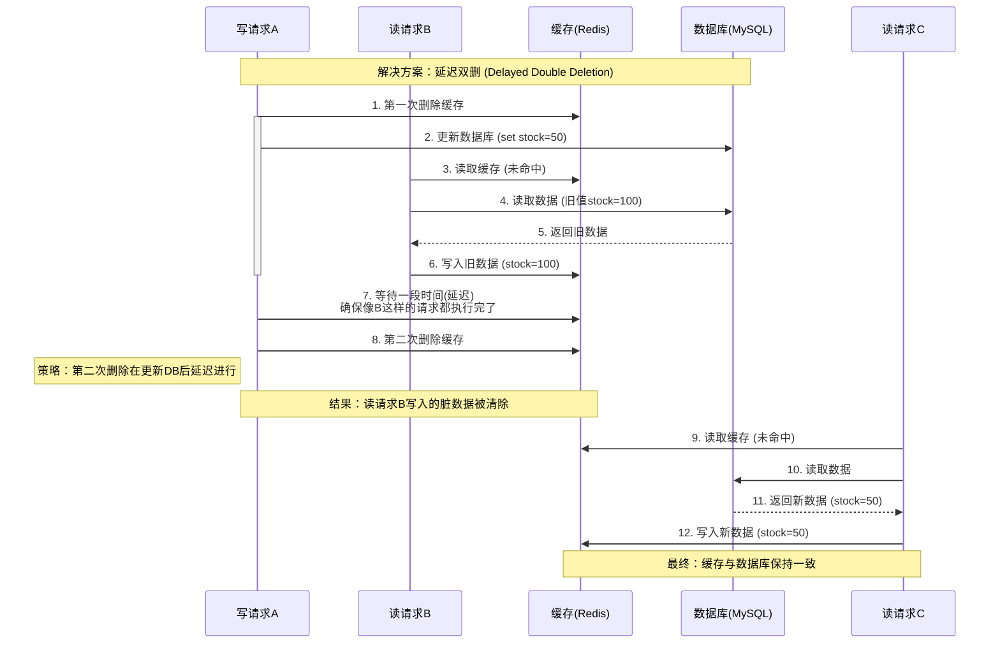
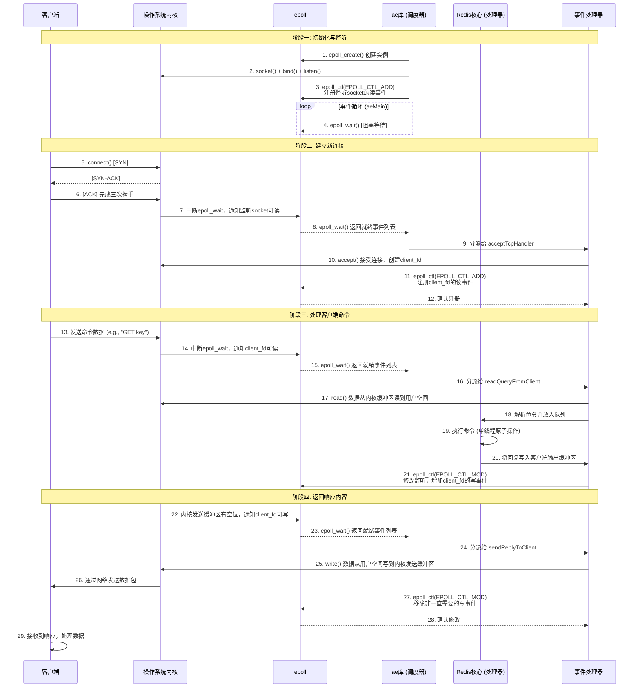
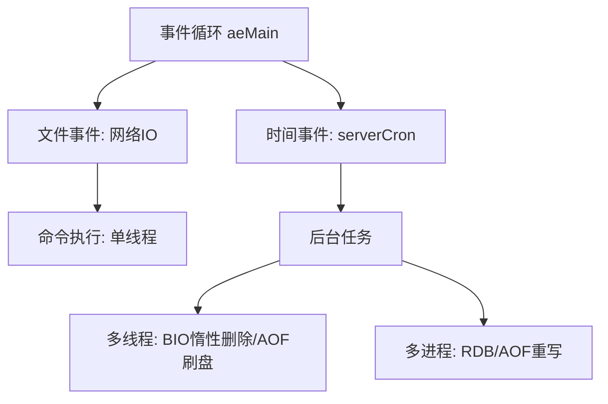
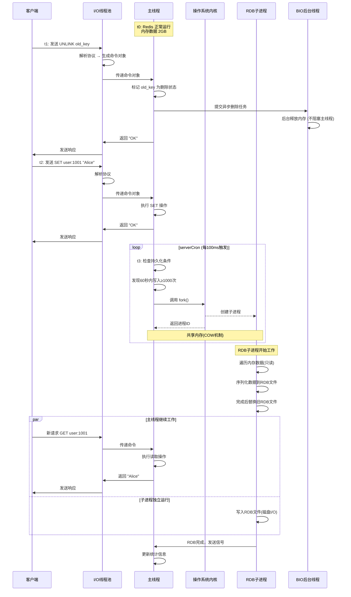
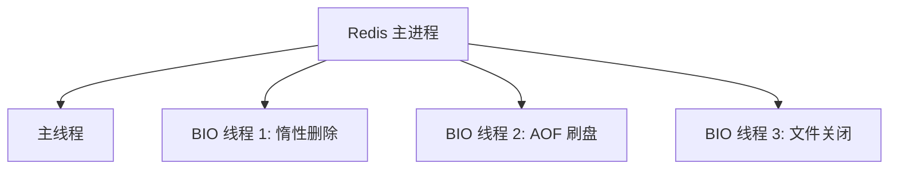

## 1 Redis 的数据结构与命令操作

### 1.1 常见类型

|   基本类型    |           示例            |        CLI 操作命令         |
|:---------:|:-----------------------:|:-----------------------:|
|  String   |         `"Hello"`         |  [操作](#122-string-操作)   |
|   Hash    | `{name: "Jack", age: 21}` |   [操作](#123-hash-操作)    |
|   List    |   `[A -> B -> C -> C]`    |   [操作](#124-list-操作)    |
|    Set    |        `{A, B, C}`        |    [操作](#125-set-操作)    |
| SortedSet |   `{A: 1, B: 2, C: 3}`    | [操作](#126-sortedset-操作) |

|   拓展类型   |          示例          |                             CLI 操作命令                             |
|:--------:|:--------------------:|:----------------------------------------------------------------:|
|   GEO    | `{A: (123.45, 45.78)}` |     [官方文档](https://redis.io/docs/latest/commands/?group=geo)     |
|  BitMap  |   `011100010111001`    |   [官方文档](https://redis.io/docs/latest/commands/?group=bitmap)    |
| HyperLog |   `011100010111001`    | [官方文档](https://redis.io/docs/latest/commands/?group=hyperloglog) |

### 1.2  CLI 命令

#### 1.2.1 Keys 操作

- 查询
	- 列举符合要求的 key，pattern 可用符号 “\*” 作为通配符

	```shell
	KEYS <pattern>
	```

	- 检查某一 key 是否存在，返回值为 1 或 0

	```shell
	EXSISTS <key>
	```
	


- 删除

```shell
DEL <key> [more keys]
```

输入后，返回实际删除的 key 的数目

- 有效期

	- 设置 key 的有效期

	```shell
	EXPIRE <key> <seconds>
	```

	- 查看 key 的有效期

	```shell
	TTL <key>
	```

	返回值 > 1，表示 key 的剩余时间

	返回值 == -1，表示 key 永久不过期

	返回值 == -2，表示 key 已经失效

#### 1.2.2 String 操作

**类似**：Java 的 String

- 添加 / 修改

```shell
SET <key> <value>	# 添加/修改单个 KV 数据
MSET <k1> <v1> [<k2> <v2> ...]	# 批量添加/修改操作

# NX: Not Exist，当键不存在时设值，否则返回0
SET <key> <value> NX # 添加 KV 对，如果 K 不存在；成功返回 1，不成功返回 0
SETNX <key> <value>	 # 同上条，成功返回 1，不成功返回 0

# EX: Expire，为键值设定过期时间
SET <key> <value> EX <seconds>	# 添加/修改 KV 对并设置有效期
SETEX <key> <value> <seconds>	# 同上条
```

- 获取

```shell
GET <key>
MGET <k1> [<k2> ...]
```

- 自增 / 自减

对于 INCR，使用的 key 的值必须是可被序列化成整数数字的内容，有效示例："10"，"-1"，"0"，"1234567890"；无效示例 "3.14"，"100a"，"hello"；

对于 INCRBY，要求与 INCR 相同；

对于 INCRBYFLOAT，在 INCR 的要求的基础上允许浮点数，有效示例："10"，"3.14"，"-5.5"；

DECR 同理。

```shell
INCR <key>	# 让 key 对应的值自增 1
DECR <key>	# 让 key 对应的值自减 1

INCRBY <key> <step>			# 让 key 对应的值自增特定步长，取值范围为自然数
DECRBY <key> <step>			# 让 key 对应的值自减特定步长，取值范围为自然数

INCRBYFLOAT <key> <step>	# 让 key 对应的值自增特定步长，取值范围为任意浮点数
DECRBYFLOAT <key> <step>	# 让 key 对应的值自减特定步长，取值范围为任意浮点数
```

#### 1.2.3 Hash 操作

大致与上文一致，主要区别在于，确定一个 value 时，还需要一个 field 作为索引，命令名称开头均为 `H`；操作基本上都是对同一个 KEY
的多组 field-value 的操作；呈现出来的是一个 key 对应了一个两列的表格

**类似**：Java 的 HashMap

- 添加 / 修改

```shell
HSET <key> <field> <value> [field value ...] [NX] [EX]
# 自4.0起，HMSET 已弃用

HSETNX <key> <field> <value>

HSETEX <key> <value> <seconds>
```

- 查询

```shell
HGET <key> <field>	# 获取 key 对应值中某一个 field 的值
HMGET <k1> <field1> [k2 field2 ...]

HKEYS <key>	# 获取一个 key 对应值中的所有 field
HVALS <KEY> # 获取一个 key 对应值中的所有 field 的值
```

- 自增 / 自减

```shell
HINCR <key> <field>	# 让 key.field 的值自增 1

HINCRBY <key> <field> <step>		# 让 key 对应值的 field 的值自增特定步长，取值范围为自然数
HINCRBYFLOAT <key> <field> <step>	# 让 key 对应值的 field 的值自增特定步长，取值范围为任意浮点数
```

#### 1.2.4 List 操作

这个 List 指的是一种双向链表数据类型，支持**插入**、**弹出**、**范围查询**操作，呈现出来的是一个 key 中有一列元素

**类似**：Java 的 LinkedList

**特点**：可以用作链表、队列

**应用场景**：消息队列

- 插入

  ```mermaid
  block
    lpushArrow<["LPUSH"]>(right)
    element1
    element2
    element3
    element4
    ...
    rpushArrow<["RPUSH"]>(left)
  ```

  ```shell
  LPUSH <key> <element1> [element2...] # 从左侧插入
  RPUSH <key> <element1> [element2...] # 从右侧插入
  ```

- 弹出
	
	```mermaid
	block
	  lpopArrow<["LPOP"]>(left)
	  element1
	  element2
	  element3
	  element4
	  ...
	  rpopArrow<["RPOP"]>(right)
	```
	
	```shell
	LPOP <key> <number> # 从左侧依次弹出 number 个元素
	RPUSH <key> <number> # 从右侧依次弹出 number 个元素
	```
	
- 范围查询
	```shell
	LRANGE <key> <start> <number>	# 从左侧，start 开始（取值从 0 开始），列举 number 个元素
	```

- 阻塞式弹出
	```shell
	BLPOP <key> [timeout=0]	# 从左侧查询 key，如果查询到了则直接返回，查询不到则在 timeout 秒内一直查
	```

#### 1.2.5 Set 操作

**类似**：Java 的 HashSet

**特点**：无序、数据唯一、查询快、支持交并差运算

- 插入

	```shell
	SADD <key> <menber1> [member2 ...]
	```

- 查询
	```shell
	SMEMBERS <key>	# 查询 key 中拥有的 member
	SCARD <key>		# 清点 key 中有多少个元素
	SISMEMBER <key> <member>	# 查询 member 是否存在于 key 中
	```

- 计算
	```shell
	SINTER <key1> <key2> [key3...]	# 计算并返回交集
	SUNION <key1> <key2> [key3...]	# 计算并返回并集
	SDIFF <key1> <key2> [key3...]		# 计算并返回差集
	```

#### 1.2.6 SortedSet 操作

**类似**：Java 的 TreeSet

**特点**：可排序、元素唯一、查询快

**应用场景**：排行榜

- 插入

	```shell
	ZADD <key> [NX] <score> <member> [score member...]
	```

- 删除

	```shell
	ZREM <key> <member> [member...]	# 删除 key 中指定的 member
	```


- 查询

	以下查询操作均支持 WITHSCORES 参数，用于返回分数；

	排序操作默认是从小到大排序的，若要从大到小排序，需要在命令 Z 后面加上 REV

	```shell
	ZSCORE <key> <member>	# 查询 key 中指定 member 的分数
	ZRANK <key> <member>	# 查询 key 中指定 member 的排名
	
	ZCOUNT <key> <min> <max>	# 查询 key 中分数在 min 和 max 之间的元素个数
	ZRANGE <key> <start> <stop> [WITHSCORES]	# 按分数排名后，查询 key 中排名在 start 和 stop 之间的元素
	ZRANGEBYSCORE <key> <min> <max> [WITHSCORES]	# 按分数排名后，查询 key 中分数在 min 和 max 之间的元素
	
	ZCARD <key>	# 查询 key 中有多少个元素
	```

- 修改
	```shell
	ZINCRBY <key> <step> <member>	# 让 key 中指定 member 的分数增加 step
	```

- 计算
	```shell
	ZINTER <key1> <key2> [key3...]	# 计算并返回交集
	ZUNION <key1> <key2> [key3...]	# 计算并返回并集
	ZDIFF <key1> <key2> [key3...]		# 计算并返回差集
	
	ZINTERSTORE <dest> <key1> <key2> [key3...]	# 计算、存储并返回交集
	ZUNIONSTORE <dest> <key1> <key2> [key3...]	# 计算、存储并返回并集
	ZDIFFSTORE <dest> <key1> <key2> [key3...]		# 计算、存储并返回差集
	```

#### 1.2.7 TTL 操作

官方文档：[Commands | Docs](https://redis.io/docs/latest/commands/?name=expire)

|          | 设置操作，给定相对时间                                       | 设置操作，给定绝对时间戳                                     | 查询操作，查询过期时间戳                            |
| -------- | ------------------------------------------------------------ | ------------------------------------------------------------ | --------------------------------------------------- |
| 键       | EXPIRE key seconds [NX \| XX \| GT \| LT]                    | EXPIREAT key unix-time-seconds [NX \| XX \| GT \| LT]        | EXPIRETIME key                                      |
| 键       | PEXPIRE key milliseconds [NX \| XX \| GT \| LT]              | PEXPIREAT key unix-time-milliseconds [NX \| XX \| GT \| LT]  | PEXPIRETIME key                                     |
| 哈希字段 | HEXPIRE key seconds [NX \| XX \| GT \| LT] FIELDS numfields field   [field ...] | HEXPIREAT key unix-time-seconds [NX \| XX \| GT \| LT] FIELDS numfields   field [field ...] | HEXPIRETIME key FIELDS numfields field [field ...]  |
| 哈希字段 | HPEXPIRE key milliseconds [NX \| XX \| GT \| LT] FIELDS numfields field   [field ...] | HPEXPIREAT key unix-time-milliseconds [NX \| XX \| GT \| LT]   FIELDS numfields field [field ...] | HPEXPIRETIME key FIELDS numfields field [field ...] |


#### 1.2.8 库命令

- 清空一个库

```shell
SELECT <number>	# 选中一个库，若不写，默认是 db0
FLUSHDB			# 清空选中的库
```

- 清空一个库（非阻塞）

```shell
FLUSHDB ASYNC
```

- 清空所有库

```shell
FLUSHALL
```

- 清空所有库（非阻塞）

```shell
FLUSHALL ASYNC
```


### 1.3 脚本命令

Redis 中允许输入 Lua 脚本已实现更高级的操作。**Lua** 是一种轻量级、高效、可嵌入的脚本语言。它的设计目标就是能够轻松地嵌入到其他应用程序中，为应用程序提供灵活的扩展和定制功能。

**Lua 脚本的特点：**

- **轻量**：体积小巧，解析器只有几百KB。
- **快速**：执行效率高。
- **可嵌入**：很容易被 C/C++、Java、Go 等语言编写的程序集成。
- **简单**：语法清晰简单，易于学习。

**Redis 使用 Lua 的好处：**

1. **原子性 (Atomicity)**：脚本中的所有命令会作为一个整体顺序执行，不会被中断。
2. **减少网络开销 (Reduced Network Overhead)**：将多个操作组合成一个脚本，一次发送，一次返回。
3. **灵活性 (Flexibility)**：可以利用 Lua 语言的所有特性（变量、循环、条件、函数等）实现复杂逻辑。

在 redis-py 中，有**两种方式执行 Lua 脚本**：

**方法一：直接使用 `eval()` 接口**

`eval(script, num_keys, *keys_and_args)` 方法接收以下参数：

- `script`：Lua 脚本的字符串内容。
- `num_keys`：脚本中涉及的键（KEYS）的数量。
- `*keys_and_args`：紧接着是具体的键名（Key）和参数（Argv）。

```python
import redis

r = redis.Redis(host='localhost', port=6379, db=0)

# 定义Lua脚本字符串
lua_script = """
if redis.call("get", KEYS[1]) == ARGV[1] then
    return redis.call("del", KEYS[1])
else
    return 0
end
"""

# 假设这是加锁时设置的唯一值
lock_value = "unique_client_id_123"
lock_key = "lock:resource_1"

# 使用 eval 执行脚本
# 1 表示有1个Key (lock_key)
# lock_key 是第一个参数，对应 KEYS[1]
# lock_value 是第二个参数，对应 ARGV[1]
result = r.eval(lua_script, 1, lock_key, lock_value)

print(result)  # 如果成功删除返回 1， 否则返回 0
```

**方法二：使用 `Script` 对象（推荐，效率更高）**

如果同一个脚本需要多次执行，使用 `eval` 每次都需要将完整的脚本字符串发送到服务器，浪费带宽。`redis-py` 提供了 `Script` 类来优化这个过程。

**原理**：`Script` 对象的核心是 **`SCRIPT LOAD`** 命令。它先将脚本发送到 Redis 服务器，服务器会返回一个该脚本的 **SHA1 校验和**。之后要执行这个脚本时，只需要发送这个 SHA1 值和所需的参数即可，无需再发送完整的脚本内容。

```python
import redis

r = redis.Redis(host='localhost', port=6379, db=0)

# 定义同样的Lua脚本
lua_script = """
if redis.call("get", KEYS[1]) == ARGV[1] then
    return redis.call("del", KEYS[1])
else
    return 0
end
"""

# 根据 Lua 代码字符串创建一个 Script 对象
script = r.register_script(lua_script)

# 现在，你可以像调用函数一样调用这个脚本
lock_value = "unique_client_id_123"
lock_key = "lock:resource_1"

# 执行脚本，传入 keys 和 args
result = script(keys=[lock_key], args=[lock_value])

print(result)
```


## 2 SDK 操作

### 2.1 Java 操作

#### 2.1.1 Jedis

#### 2.1.2 Spring Data Redis

操作都是基于 RedisTemplate，可以使用 RedisTemplate 的 opsForXXX 方法获取对应的操作对象，再调用操作对象的 set、get
等方法进行操作。方法名的命名更对应 Java 对应数据结构的方法名。

RedisTemplate 对象在 Java Bean 中可以直接从 Spring 容器中获取，也可以通过注解 @Autowired 注入。

一般情况下，需要用自己的 RedisTemplate 对象，因为默认的 RedisTemplate 对象的序列化方式是
JdkSerializationRedisSerializer，不太适合存储字符串，总是会把字符串转为字节流再存储，取出来时也是字节流，不太方便。因此可以衍生出以下两种解决方案：

- 方案一：

自定义一个 RedisTemplate 对象，设置序列化方式为 GenericJackson2Js.onRedisSerializer，然后用 `@Bean` 注解放到容器里面。

```java
@Bean
public RedisTemplate<String, Object> redisTemplate(RedisConnectionFactory redisConnectionFactory) {
    RedisTemplate<String, Object> template = new RedisTemplate<>();
    template.setConnectionFactory(redisConnectionFactory);
    Jackson2JsonRedisSerializer<Object> serializer = new Jackson2JsonRedisSerializer<>(Object.class);
    template.setValueSerializer(serializer);
    template.setKeySerializer(new StringRedisSerializer());
    template.afterPropertiesSet();
    return template;
}
```

- 方案二：

统一使用 StringRedisTemplate，手动序列化和反序列化。

```java
@Autowired
private StringRedisTemplate stringRedisTemplate;

private static final ObjectMapper objectMapper = new ObjectMapper();

public void<T> set(String key, T value) {
    // 存
    try {
        stringRedisTemplate.opsForValue().set(key, objectMapper.writeValueAsString(value));
    } catch (JsonProcessingException e) {
        e.printStackTrace();
    }
    // 取
    try {
        String json = stringRedisTemplate.opsForValue().get(key);
        if (json != null) {
            return objectMapper.readValue(json, T.class);
        }
    } catch (JsonProcessingException e) {
        e.printStackTrace();
    }
}
```

#### 2.1.3 Redisson（待补充）


### 2.2 Python 操作（待补充）

#### 2.2.1 redis-py（待补充）


## 3 Redis 应用

命名要求：

项目: 业务: 数据类型: ID

### 3.1 缓存

#### 3.1.1 缓存与数据一致性问题

##### （1）Cache-Aside

写：删缓存、改数据、写缓存、返回结果

读：读缓存、（读数据、写缓存）、返回结果




##### （2）Write-Through

写：改缓存改数据、返回结果

读：读缓存、（读数据、写缓存）、返回结果




##### （3）Write-Behind

写：写缓存、返回结果、队列记录变更、写数据库

读：读缓存、（读数据、写缓存）、返回结果




##### （4）延迟双删（Cache-Aside 优化）

写：**删**缓存、写数据库、等待一段时间、**删**缓存

读：读缓存、（读数据、写缓存）、返回结果




##### （5）总结

| 方案                            | 核心思想                                                     | 优点                                                         | 缺点                                                         | 适用场景                                                     |
| :------------------------------ | :----------------------------------------------------------- | :----------------------------------------------------------- | :----------------------------------------------------------- | :----------------------------------------------------------- |
| **Cache-Aside (旁路缓存)**      | **读：** 先读缓存，未命中则读DB再回填。 **写：** 更新DB，然后**删除缓存**。 | 1. **实现简单**，最常用。 2. 缓存仅包含实际请求的数据，**资源利用率高**。 3. 故障影响小（缓存挂掉仅导致DB压力增大）。 | 1. **存在数据不一致窗口**（更新DB后，删缓存前）。 2. **缓存击穿**：冷门数据突然爆款，大量请求穿透到DB。 3. 需要为缓存设置TTL作为兜底。 | **绝大多数场景**。对一致性要求不是极端严格的业务，如用户信息、商品展示页。 |
| **Write-Through (直写)**        | **写：** 同时（原子地）更新缓存和DB。 **读：** 直接读缓存。  | 1. **理论上能保证强一致性**（如果实现正确）。 2. 读性能极佳。 | 1. **写入性能差**，每次写操作都涉及缓存和DB。 2. **实现复杂**，需保证两个独立系统写的原子性。 3. 可能缓存不常读的数据，**资源利用率低**。 | **极少使用**。通常需要特定缓存组件支持，或对一致性有极端要求的极小规模应用。 |
| **Write-Behind (后写)**         | **写：** 先更新缓存，**异步**批量更新DB。 **读：** 直接读缓存。 | 1. **写入性能极高**，用户体验好。 2. 读性能极佳。 3. 可合并多次写操作，减少DB压力。 | 1. **数据可靠性最差**，缓存与DB异步同步，**数据可能丢失**（缓存宕机）。 2. 实现非常复杂，需要可靠的消息队列和重试机制。 3. **只能保证最终一致性**。 | 对**写入速度和体验要求极高**，能容忍少量数据丢失的场景。如：计数器、点赞、浏览量。 |
| **延迟双删 (Cache-Aside 优化)** | 在Cache-Aside基础上，写操作时： 1. 先删缓存。 2. 更新DB。 3. **延迟一段时间后，再次删除缓存**。 | 能**有效解决**高并发下Cache-Aside模式的**脏数据问题**，大幅降低不一致窗口。 | 1. **延迟时间难以精确设定**（需大于“读DB+写缓存”耗时）。 2. **降低写入吞吐**，写请求需等待延迟。 3. 第二次删除失败仍会导致不一致。 | Cache-Aside模式的**增强**。用于对一致性要求**较高**的业务，如商品库存、秒杀信息。 |
| **Binlog监听 (CDC)**            | 通过监听MySQL的Binlog日志来**感知数据变更**，并自动删除或更新Redis缓存。 | 1. **完全解耦**，缓存失效逻辑与业务代码分离。 2. **可靠性高**，基于DB的复制日志。 3. 可达到**近实时**的缓存失效。 | 1. **系统架构最复杂**，需要引入和维护额外的组件（Canal/Debezium）。 2. 有额外的延迟。 | **大型、复杂系统**。适合需要构建可靠、可扩展的缓存失效机制，且有能力维护相关中间件的团队。 |


#### 3.1.2 缓存问题与解决方案

| 问题           | 现象与危害                                                   | 解决方案                                                     |
| :------------- | :----------------------------------------------------------- | :----------------------------------------------------------- |
| **缓存穿透**   | 查询一个**数据库中根本不存在**的数据（如不存在的ID）。导致请求穿透缓存，直接访问数据库，可能压垮数据库。 | 1. **缓存空值**：即使查询为空，也缓存一个短TTL的空对象（如 `SET key null 60s`）。 2. **布隆过滤器 (Bloom Filter)**：将所有可能存在的key哈希到一个 bitmap 中。请求先经过布隆过滤器，如果判断不存在，直接返回，避免访问数据库和缓存。 |
| **缓存击穿**   | **某个热点key过期**的瞬间，大量并发请求同时涌来，击穿缓存，全部去数据库加载数据，造成数据库压力激增。 | 1. **互斥锁 (Mutex Lock)**：使用 `SETNX`或 `Redisson`等工具加分布式锁。只允许一个线程去重建缓存，其他线程等待或返回旧值。 2. **“逻辑”过期/永不过期**：不给key设置TTL，而是将过期时间存储在value中。后台任务异步更新缓存。 |
| **缓存雪崩**   | **大量缓存key在同一时间大面积过期**或**Redis服务宕机**，导致所有请求都涌向数据库，造成数据库级联宕机。 | 1. **随机过期时间**：给缓存TTL加上一个随机值（如 `基础时间 + random(0, 300)s`），避免同时失效。 2. **构建高可用集群**：采用 Redis Sentinel（哨兵）或 Cluster（集群）模式，防止单点故障。 3. **服务熔断与降级**：使用 Hystrix 等组件，当数据库压力过大时，对请求进行熔断或返回默认值。 |
| **数据一致性** | 资金、库存、订单 等核心领域的不一致，直接造成财务损失和重大客户投诉，动摇商业根基；非核心业务的计数、缓存等的不一致，影响体验，但可快速恢复或用户感知不强。如点赞数、浏览量短暂不准。 | Cache-Aside、Write-Through、Write-Behind、延迟双删、Binlog监听。详见 3.1.1 |


### 3.2 消息队列

消息队列（MessageQueue），字面意思就是存放消息的队列。最简单的消息队列模型包括3个角色：

- 生产者（Producer）：送消息到消息队列
- 消费者（Consumer）：消息队列获取消息并处理消息
- 队列（Queue）：存储和管理消息，也被称为消息代理（MessageBroker）

RabbitMQ、Kafka、RocketMQ、ActiveMQ 等都是消息队列的实现，下文将讨论基于 Redis 的 List 结构、Pub/Sub 模式、Stream 结构的消息队列实现。

#### 3.2.1 List 结构消息队列

List 结构是一个双向链表，可以用来实现消息队列。生产者通过 `LPUSH` 命令将消息插入到队列的左侧，消费者通过 `BRPOP`
命令从队列的右侧阻塞获取消息。

```shell
LPUSH items item1 item2 item3
```

```shell
BRPOP items timeout=500
```

优点：

- 利用 Redis 的持久化特性，可以保证消息不会丢失
- 可满足简单的消息队列需求

缺点：

- 无法避免消息丢失（如消费者异常退出后，任务完成情况未知）
- 无法实现广播（消息只能被一个消费者消费）

#### 3.2.2 Pub/Sub 模式消息队列

Pub/Sub（发布订阅）是 Redis2.0 版本引入的消息传递模型。顾名思义，消费者可以订阅一个或多个channel，生产者
向对应channel发送消息后，所有订阅者都能收到相关消息。

常用命令：

- `SUBSCRIBE channel [channel1 ...]`：订阅一个或多个 channel
- `UNSUBSCRIBE channel [channel1 ...]`：取消订阅一个或多个 channel
- `PUBLISH channel message`：向 channel 发送消息
- `PSUBSCRIBE pattern1 [pattern2]`：订阅一个或多个符合 pattern 的 channel
- `PUNSUBSCRIBE pattern1 [pattern1 pattern2 ...]`：取消订阅一个或多个符合 pattern 的 channel

> Pattern 是一个通配符，可以用来表示多个 channel 名称。符号 `*` 可以表示任意字符，符号 `?` 可以表示一个字符。
>
> 例如，订阅所有以 `news` 开头的 channel，可以使用 `PSUBSCRIBE news*` 命令；订阅以 `new` 开头，任意一个字符结尾的
> channel，可以使用 `PSUBSCRIBE new?` 命令。

优点：

- 可以实现广播，支持多生产者、多消费者

缺点：

- 无法保证消息不丢失（若消费者宕机，消息直接丢失）
- 不支持消息持久化
- 消息堆积有上限，不适合大量消息的场景（消息都堆在消费者处）

#### 3.2.3 Stream 结构消息队列

##### （1）单消费者模式

Stream 是 Redis5.0 版本引入的数据结构，能够实现功能完善的消息队列。Stream 用于存储时间序列数据。Stream
结构可以看作是一个消息队列，每个消息都有一个唯一的 ID，消息可以按照时间顺序存储。

###### 1. 发送消息

官方文档：[XADD | Docs](https://redis.io/docs/latest/commands/xadd/)

命令格式：

```shell
XADD <key> [NOMKSTREAM] [MAXLEN|MINID [=|~] threshold [LIMIT <count>]] *|ID field1 value1 [field2 value2 ...]
```

`NOMKSTREAM`：不创建 key，如果 key 不存在则报错

`MAXLEN`：限制 Stream 的长度，当 Stream 的长度超过 threshold 时，会自动删除旧消息

`MINID`：限制 Stream 的 ID，当 Stream 的 ID 超过 threshold 时，会自动删除旧消息

`LIMIT`：限制 Stream 的长度，当 Stream 的长度超过 count 时，会自动删除旧消息

`* | ID`：使用自动生成 ID 或者自定义 ID，自动生成的 ID 会是 `时间戳-序列号` 格式，其中时间戳是消息生成时的 Unix 时间（毫秒级），由 Redis 服务器自动生成；序列号是同一毫秒内多条消息的递增序号（从 0 开始），用于解决高并发下的冲突。

例如：

```shell
# 向名字为 mystream 的流通道，以自动生成的 ID 发送 "name:Jack,age:21" 数据
# XADD <key> *|ID field1 value1 field2 value2
XADD mystream * name Jack age 21
```

###### 2. 读取消息

官方文档：[XREAD | Docs](https://redis.io/docs/latest/commands/xread/)

命令格式：

```shell
XREAD [COUNT <count>] [BLOCK <milliseconds>] STREAMS key1 [key2 key3 ...] ID1 [ID2 ID3 ...]
```

`COUNT <count>`：读取消息的数量为 count

`BLOCK <milliseconds>`：阻塞时间为 milliseconds，如果不给该参数，则该命令为同步的；

`STREAMS <KEY...>`：读取/选择的一个或多个 Stream 名称

`ID`：读取的**起始** ID，表示读取从该 ID 开始的所有数据，与前面的 key 一一对应；可以使用 `0` 或 `0-0` 表示从第一条消息开始读取；`$` 表示**从当前开始**读取，一般结合 `BLOCK` 使用，读取一段时间内的所有数据；`+` 表示返回最后一条消息，用 `+` 时，`COUNT` 会被忽略，因为无论如何只返回一条

消息读完后，历史消息不会消失，消费者总是能够使用 `XREAD` 命令，令 ID 为 0，读取到 Stream 中所有的消息。

阻塞情况下，可以令 ID 为 `$`，等待最新的**一条消息**的到来。但是若有多条消息到来或曾经到来过，只能读取开始阻塞后的一条消息，有消息漏读的风险。

> 对于 XREAD，建议分两次调用——
>
> 第一次调用时，使用 `$` 和 `BLOCK` 从当下开始截取数据，例如：
>
> ```shell
> # 第一次调用：从当前时刻开始读取新消息
> > XREAD BLOCK 5000 COUNT 100 STREAMS mystream $
> 
> # 返回示例：
> 1) 1) "mystream"
>    2) 1) 1) "1672531200000-0"
>          2) 1) "field1"
>             2) "value1"
>       2) 1) "1672531200001-0"
>          2) 1) "field2"
>             2) "value2"
> ```
>
> 获取到最新的 ID 后，后续/第二次调用时就用最后一条消息的 ID，例如：
>
> ```shell
> # 后续调用：使用上一次最后一条消息的ID（如1672531200001-0）
> > XREAD BLOCK 5000 COUNT 100 STREAMS mystream 1672531200001-0
> ```
>
> 这样的话，可能尽量避免消息漏读。

优点：

- 支持消息持久化，消息可回溯
- 一个消息可以被多个消费者消费
- 允许阻塞式读取消息

缺点：

- 有消息漏读的风险


##### （2）多消费者模式

消费者组（ConsumerGroup）：将多个消费者划分到一个组中，监听同一个队列。具备下列特点：

- 消息分流：消息只会被消费者组中的一个消费者消费
- 消息标示：每个消息都有一个唯一的 ID，消费者组会记录消费者消费到的最新消息 ID
- 消息确认：消费者获取信息后，消息处于 pending 状态，并存入一个 pending-list。消费者消费完消息后，需要向消费者组发送确认消息，消费者组会将消息从 pending-list 中删除


###### 1. 创建消费者组

命令格式：

```shell
XGROUP CREATE <key> <groupname> <ID|$> [MKSTREAM]
```

`ID`：消费者组的起始 ID，可以使用 `$` 表示从当前最新的消息开始消费

`MKSTREAM`：如果 key 队列不存在，则创建 key 队列

例如：

```shell
# 创建消费者组 mygroup，监听 mystream 队列，从当前最新的消息开始消费
XGROUP CREATE mystream mygroup $
```


###### 2. 消费者消费消息

官方文档：[XREADGROUP | Docs](https://redis.io/docs/latest/commands/xreadgroup/)

命令格式：

```shell
XREADGROUP GROUP <groupname> <consumername> [COUNT <count>] [BLOCK <milliseconds>] STREAMS key [key ...] ID [ID ...]
```

`GROUP`：消费者组名称

`consumername`：消费者名称

`COUNT`：读取消息的最大数量为 count

`BLOCK`：阻塞时间为 milliseconds

`NOACK`：获取消息后自动确认消息（不建议使用）

`STREAMS`：读取/选择的 Stream 队列名称

`ID`：读取的起始 ID，可以使用 `0` 表示从第一条消息开始读取，`>` 表示从消费者组中读取**尚未被消费的一条**消息

例如：

```shell
# 消费者组 mygroup 中的 consumer1 消费者，不等待地从 mystream 队列中读取尚未被消费的一条消息
XREADGROUP GROUP mygroup consumer1 BLOCK 0 STREAMS mystream > 
```


###### 3. 消费者确认消息

命令格式：

```shell
XACK <key> <groupname> <ID> [ID ...]
```

例如：

```shell
XACK mystream mygroup 1600000000000-0 1600000000000-1  # 消费者组 mygroup 确认消费了 mystream 队列中的 0 号 和 1 号两条消息
```

正常情况下，消费者拿消息、消费者确认消息。但要是有消费者宕机，没有正常地完成消息，我们可以从 pending-list 中找到未确认的消息，重新分配给其他消费者。


###### 4. 查看 pending-list

命令格式：

```shell
XPENDING <key> <groupname> [[IDLE min-idle-time] <start> <end> <count> [consumer]]
```

`IDLE`：消费者拿了消息后，min-idle-time 时间内没有确认消息

`start`：想获取的最小的 ID，若为 `-`，表示最小的 ID

`end`：想获取的最大的 ID，若为 `+`，表示最大的 ID

`count`：想获取的消息数量

`consumer`：想获取的消费者名称

例如：

```shell
# 查看消费者组 mygroup 中的 pending-list，不限 ID 范围，获取 10 条消息
XPENDING mystream mygroup - + 10
```

优点：

- 支持消息持久化，消息可回溯
- 一个消息可以被多个消费者消费
- 允许阻塞式读取消息
- 实现了消息确认机制，保证消息不会丢失、漏读

#### 3.2.4 消息队列对比

|              |                   List                   |      Pub/Sub       |                         Stream                         |
| :----------: | :--------------------------------------: | :----------------: | :----------------------------------------------------: |
|  消息持久化  |                   支持                   |       不支持       |                          支持                          |
|   阻塞读取   |                   支持                   |        支持        |                          支持                          |
| 消息队列堆积 | 受限于内存空间，可以利用多消费者加快处理 | 受限于消费者缓冲区 | 受限于队列长度，可以利用消费者组提高消费速度，减少堆积 |
| 消息确认机制 |                  不支持                  |       不支持       |                          支持                          |
|   消费回溯   |                  不支持                  |       不支持       |                          支持                          |


### 3.3 分布式锁

**Redis 分布式锁的核心思想是利用 Redis 单线程原子性和高性能的特点，在分布式系统环境中实现一个跨进程、跨服务器的互斥机制。**

即不同主机上、不同进程下运行的程序，都可通过访问 Redis 的形式，检查程序运行是所需的锁是否满足，已实现并发控制、通知等功能。

在技术实现上，它通常是通过在 Redis 中**设置一个特定的键值对（Key）** 来完成的。如果这个键存在，就认为锁已被占用；如果不存在，就可以创建它来获取锁。

完整的实现分布式锁的流程是：

- 在 `SETNX` 成功后，立即给锁 key 设置一个过期时间（`EXPIRE key timeout`）。
- 这样即使服务器崩溃，锁也会在超时后自动释放，避免了死锁。
- **问题**：`SETNX` 和 `EXPIRE` 是两个独立操作，不是原子的。如果在这两条命令之间服务器崩溃，`EXPIRE` 没来得及执行，依然会造成死锁。
- **实现方法**：使用带参数的 `SET` 指令和 lua 脚本，将多个操作合并为一个原子操作，加锁/续期和解锁的代码分别如下：

```lua
-- 加锁/续期
-- 参数：KEYS[1] - 锁的键名
--      ARGV[1] - 锁的唯一标识符（UUID）/ 键的值
--      ARGV[2] - 锁的过期时间（毫秒）

-- 检查锁是否已存在，且值是自己
if redis.call("exists", KEYS[1]) == 1 then
    -- 如果锁存在，值增加/更改并续期
    redis.call("set", KEYS[1], ARGV[1])
    redis.call("pexpire", KEYS[1], ARGV[2])
    return 1
else
    -- 如果不锁存在，设置锁和过期时间
    redis.call("set", KEYS[1], ARGV[1], "PX", ARGV[2])
    return 1
end
```

```lua
-- 解锁
-- 参数：KEYS[1] - 锁的键名
--      ARGV[1] - 锁的唯一标识符（UUID）

-- 检查锁是否存在且标识符匹配，且值是自己
if redis.call("get", KEYS[1]) == ARGV[1] then
    -- 删除锁
    redis.call("del", KEYS[1])
    return 1
else
    return 0
end
```


## 4 Redis 核心

### 4.1 serverCron

#### 4.1.1 基本介绍

`serverCron` 是 Redis 的**核心后台定时任务**，由主线程周期性执行（单线程架构下，主线程既处理客户端请求，也运行后台任务）。它是 Redis 维持高效运行、实现关键功能的“心脏”。

主要负责工作：

**1. 过期键清理（`ACTIVE_EXPIRE_CYCLE`）**

- **任务**：执行**定期删除策略**（与惰性删除互补）。
- **逻辑**：按配置的 `hz`频率，在限制的 CPU 时间内，随机抽样检查并删除过期键。
- **重要性**：防止内存被无效键占用，是内存管理的关键。

**2. 持久化协调**

- **RDB**：
  - 检查是否满足自动触发条件（如 `save 900 1`）。
  - 若满足，启动 `BGSAVE`（fork 子进程）。
- **AOF**：
  - 根据 `appendfsync`策略（everysec/always），将 AOF 缓冲区数据刷盘（everysec 时在此执行）。
  - AOF 文件重写（`BGREWRITEAOF`）的触发检查。

**3. 状态监控与维护**

- **更新统计信息**：如内存使用量、键数量、命中率等（`INFO`命令的数据源）。
- **客户端管理**：
  - 关闭超时的客户端连接（`timeout`配置）。
  - 清理不活跃的客户端缓冲区。
- **集群与复制**：
  - 主从复制：发送心跳（`REPLCONF ACK`）、检测超时、重连从节点。
  - Cluster 模式：故障检测、更新集群状态。

**4. 内存管理**

- **内存淘汰（Eviction）**：
  - 当内存达 `maxmemory`时，按策略（LRU/LFU等）删除键。
  - 执行淘汰逻辑的入口在此。
- **碎片整理**：根据 `activedefrag`配置，尝试合并内存碎片。

**5. 其他维护**

- **增量式 Rehash**：对正在渐进式 Rehash 的哈希表，移动少量桶。
- **延迟统计**：计算操作延迟峰值并记录。
- **模块系统**：调用模块的定时任务钩子。


#### 4.1.2 相关配置

| **参数** | **默认值** | **作用**                                                     |
| :------- | :--------- | :----------------------------------------------------------- |
| `hz`     | 10         | 每秒执行 `serverCron`的次数。**提高值可加速后台任务，但增加 CPU 开销**。 |


### 4.2 持久化

RDB (Redis Database) 和 AOF (Append Only File) 是 Redis 提供的两种不同的数据持久化方式，它们各有优劣，共同保证了 Redis 的数据安全性和性能。二者可选其一也可以同时开启，以下是他们的区别：

| 特性           | RDB                                                          | AOF                                     |
| :------------- | :----------------------------------------------------------- | :-------------------------------------- |
| **持久化方式** | 定时生成数据快照                                             | 记录每一次写操作**命令**                |
| **数据安全性** | 较低，可能丢失一段时间的数据                                 | 非常高，根据配置最多丢失1秒或更少的数据 |
| **文件体积**   | 小（二进制压缩格式）                                         | 大（文本格式，可通过重写优化）          |
| **恢复速度**   | **快**（直接加载二进制数据到内存）                           | **慢**（需要逐条执行命令重建数据）      |
| **对性能影响** | `fork`子进程时可能有短暂阻塞                                 | 写入和同步对性能有轻微影响              |
| **优先级**     | 如果**同时开启**，Redis重启时会**优先使用AOF**文件来恢复数据，因为AOF通常数据更完整。 |                                         |

下面对两者的工作流程进行详细介绍。

#### 4.2.1 RDB

##### （1）工作流程

1. **创建快照**：当满足配置条件（如“900秒内至少有1个键被更改”）时，Redis 会 `fork` 一个子进程。
2. **子进程工作**：子进程负责将<u>内存中的数据</u>写入到一个临时的 RDB 文件中。
3. **替换旧文件**：当子进程完成写文件后，会用新的 RDB 文件替换旧的 RDB 文件。

**注意**：`fork` 操作是同步的，但写入 RDB 文件的过程由子进程完成，**主进程会继续处理客户端请求**，几乎不受影响。只有在 `fork` 的瞬间可能会阻塞。


<Accordion label="若是子进程在复制过程中，外部命令修改了内存中的数据怎么办？">
结论：Redis 没有针对这种情况做任何处理！新的 RDB 文件不会有新的修改记录，内存中的数据会正常被修改，核心机制来源于操作系统的“写时复制”

分析——

**前提**：Redis 主进程（父进程）正在运行，处理客户端请求，数据存储在内存中。

**步骤 1：触发 `BGSAVE`**

- 管理员执行 `BGSAVE`命令，或 Redis 根据配置（如 `save 60 10000`）自动触发。
- 主进程准备开始后台保存。

**步骤 2：主进程调用 `fork()`**

- 主进程执行 `fork()`系统调用。
- 操作系统内核创建子进程：
  - **复制父进程的页表**：子进程获得一份与父进程完全相同的页表副本。
  - **共享物理内存**：此时，父子进程的页表项指向**完全相同**的物理内存页。Redis 的所有数据都在这片内存中。
  - **子进程状态**：子进程从 `fork()`返回点开始执行代码（通常是 Redis 中专门负责写 RDB 文件的函数）。**此时子进程拥有 `fork()`瞬间 Redis 内存数据的完整、一致的快照视图**。这是 RDB 一致性的基础。

**步骤 3：子进程执行备份（只读操作）**

- 子进程开始遍历自己的内存空间（这个空间在 `fork()`瞬间与父进程完全一致）。
- 子进程将内存中的数据（键值对）按照 RDB 格式序列化。
- 子进程将序列化后的数据写入磁盘上的临时 RDB 文件（通常命名为 `temp-<pid>.rdb`）。
- **关键点**：子进程在整个过程中**只读取**内存。它不会修改任何 Redis 数据内存。

**步骤 4：主进程继续处理请求（可能触发 COW）**

- 在子进程进行备份的同时，主进程**照常运行**。
- 主进程继续接收并处理客户端的命令，包括**读取和写入**命令。
- **处理读取命令**：主进程直接从共享的物理内存页中读取数据（如果该页未被修改过）。
- **处理写入命令**：
  - 当主进程需要修改某个键的值时（例如 `SET key new_value`），它尝试写入对应的内存页。
  - 操作系统内核检测到该内存页：
    - 当前被父子进程共享（引用计数 > 1）。
    - 并且主进程试图写入。
  - **内核触发 COW**：
    1. 内核**暂停**主进程的这次写入操作。
    2. 为这个即将被修改的内存页**分配一个新的物理页**。
    3. **将旧物理页的内容完整复制到新物理页**。
    4. **更新主进程的页表**，使其指向这个新的物理页。
    5. **减少旧物理页的引用计数**（现在只有子进程还在引用它）。
    6. 恢复主进程的执行，主进程将新数据写入到**新复制的物理页**中。
  - **结果**：
    - 主进程看到了修改后的数据（在新页上）。
    - 子进程看到的仍然是旧物理页上的数据，不受影响。子进程备份的是 `fork()`瞬间的数据。

**步骤 5：子进程完成备份**

- 子进程完成对所有数据的遍历和序列化，将完整的 RDB 数据写入磁盘。
- 子进程关闭临时 RDB 文件。
- 子进程（通过父进程）用新生成的 RDB 文件原子性地替换旧的 RDB 文件（如果存在）。
- 子进程退出。

**步骤 6：主进程处理子进程退出**

- 主进程通过 `wait()`或类似机制获知子进程已退出。
- 主进程更新状态，标记 RDB 备份完成。
- 主进程可能执行一些清理工作（如删除旧的 RDB 文件，如果配置了）。
- 主进程继续正常运行。
</Accordion>


##### （2）优点

- **性能高，恢复速度快**：由于是紧凑的二进制文件，在恢复大数据集时速度比 AOF 快很多。
- **适合备份和灾难恢复**：RDB 文件是一个完整的快照，可以轻松地备份到远程数据中心或云存储上。
- **最大化 Redis 性能**：父进程不需要进行任何磁盘 I/O 操作，所有工作由子进程完成。

##### （3）缺点

- **数据安全性较低**：因为是根据配置的时间间隔进行快照，如果Redis意外宕机，你可能会丢失最后一次快照之后的所有数据（例如，如果配置为5分钟保存一次，则最多可能丢失5分钟的数据）。
- **`fork`可能阻塞**：如果数据集非常大，`fork`子进程的过程可能会耗时较长，导致主进程在毫秒级内停止服务。

#### 4.2.2 AOF

##### （1）工作流程

1. **记录命令**：每当有执行会改变数据集的命令时，Redis 会将该命令追加到 AOF 缓冲区的末尾。
2. **同步到磁盘**：根据配置的同步策略（`appendfsync`），将缓冲区中的内容写入到 AOF 文件中。
   - `always`：每个写命令都同步到磁盘。最安全，但性能最差。
   - `everysec`：每秒同步一次。在安全性和性能之间取得了很好的平衡（默认策略）。
   - `no`：由操作系统决定何时同步。性能最好，但最不安全。
3. **文件重写（Rewrite）**：由于 AOF 文件会不断增长，Redis 提供了 `BGREWRITEAOF` 命令（BackGroung REWRITE AOF也会自动触发），会 `fork` 一个子进程来创建一个新的、更精简的 AOF 文件（例如，将多次对同一个键的操作合并为最终状态的一条命令），然后用新文件替换旧文件。


<Accordion label="文件重写">
文件重写的核心是**读取键空间，生成命令**。重写过程并不像字面意思那样去分析、编辑现有的AOF文件。相反，它是通过直接读取服务器当前的数据库状态来实现的。

重写过程是由子进程在后台完成的，这需要一定的时间。在此期间，主进程仍然在正常接收并处理客户端的写命令。这就导致了一个问题：**子进程重写出的AOF快照无法包含重写开始之后新执行的命令**。

为了解决这个数据不一致的问题，Redis设置了**两个缓冲区**：

- **AOF缓冲区**：和往常一样，所有写命令都会被追加到这里，并根据 `appendfsync` 策略同步到旧的 AOF 文件中。
- **AOF重写缓冲区**：在重写**开始之后**，主进程收到的每一个写命令除了会写入到原有的AOF缓冲区外，还会额外写入到**AOF重写缓冲区**。

这样，即使在重写过程中有新的数据写入，这些命令也会被安全地保存在重写缓冲区里。
</Accordion>


<Accordion label="AOF 的重写过程">
1. 对于每个未被忽略的键，根据其**类型（String, List, Hash, Set, ZSet）** 和**当前值**，生成一条或多条相应的 Redis 命令，并将其写入临时文件。
   - **一个字符串键** `username: "Alice"` -> 生成 `SET username "Alice"`
   - **一个列表键** `mylist: ["A", "B", "C"]` -> 生成 `RPUSH mylist "A" "B" "C"`
   - **一个带TTL的键** -> 先生成设置值的命令（如 `SET`），再生成设置过期时间的命令（如 `PEXPIREAT`）。
2. 子进程完成所有数据的遍历和写入后，会强制将数据刷盘（`fsync`），确保数据写入磁盘。
3. 最后，子进程向主进程发送一个**完成信号**。
</Accordion>


<Accordion label="AOF 重写的两种触发方式">
1. **手动触发**：通过调用 `BGREWRITEAOF` 命令直接发起一个后台重写任务。

2. **自动触发**：根据用户在 `redis.conf` 配置文件中的设置，自动触发。

   ```conf
   auto-aof-rewrite-percentage 100
   auto-aof-rewrite-min-size 64mb
   ```

   - **`auto-aof-rewrite-min-size 64mb`**：表示触发重写的AOF文件最小体积，小于这个值不会触发自动重写。
   - **`auto-aof-rewrite-percentage 100`**：表示当前AOF文件大小相比**上一次重写后的大小**，增长的百分比超过了这个值，就会触发重写。

   **举个例子**：

   - 第一次重写完成后，AOF文件大小为60MB。
   - 当文件增长到 `60MB + 60MB * 100% = 120MB` 时，就会自动触发下一次重写。
   - 如果重写后文件变成50MB，那么下次触发重写的阈值就是100MB。
</Accordion>


<Accordion label="AOF的重写完成与替换">
这是整个过程中**唯一会阻塞主进程**的短暂时刻。

1. 主进程收到子进程完成的信号。
2. 主进程**阻塞**（暂停处理新请求），将 `aof_rewrite_buf` 重写缓冲区中的所有内容追加到子进程刚刚生成的临时AOF文件的末尾。**这一步确保了新AOF文件包含了重写开始时刻的全量数据 + 重写期间的所有增量数据，数据是完整的。**
3. 主进程再次确保所有数据刷盘后，**原子性地**（atomic）用新的临时AOF文件替换掉旧的AOF文件。`rename()` 操作在绝大多数文件系统中是原子的，这是一个非常安全的设计。
4. 替换完成后，主进程解除阻塞，继续服务。

至此，AOF重写全部完成。新的AOF文件是一个体积更小、但能完整恢复当前数据状态的命令日志。
</Accordion>


##### （2）优点

- **数据安全性极高**：使用默认的 `everysec` 策略，最多只会丢失1秒钟的数据。使用 `always` 策略则最多只丢失一个命令的数据。
- **可读性强**：AOF 文件是纯文本格式，记录了所有操作命令，便于理解和分析。

##### （3）缺点

- **文件体积通常更大**：相比于 RDB 文件，AOF 文件记录的是操作日志，体积通常会更大。
- **恢复速度较慢**：在数据集很大时，通过重放 AOF 日志来恢复数据的速度比RDB慢。
- **性能相对较低**：根据同步策略的不同，写入性能可能会略低于RDB（但在实际生产中，`everysec` 模式的性能依然很高）。


### 4.3 内存淘汰

#### 4.3.1 过期键的删除策略

Redis并不会在键过期后立即将其从内存中删除。因为立即删除（在 `expire` 命令执行时附加一个删除操作）需要对事件进行精确调度，这可能会阻塞服务器，影响性能。相反，Redis 采用了**惰性删除**和**定期删除**两种策略的组合，这是一种在 CPU 使用和内存使用之间取得平衡的折中方案（两个方式都采用，但都不完全依赖单一策略）。

|          | 惰性删除 (Lazy Expiration)                                   | 定期删除 (Periodic Expiration)                               |
| :------: | ------------------------------------------------------------ | ------------------------------------------------------------ |
|  是什么  | **只有在客户端尝试访问一个键时**，Redis才会检查该键是否已过期。这是键过期后的“第一道防线”。 | Redis **定期地主动**随机测试一批设置了过期时间的键，并将其中已过期的键删除。 |
| 工作流程 | 1. 客户端发送 `GET mykey` 命令。<br />2. Redis在返回键的值之前，先检查 `mykey` 是否设置了过期时间以及是否已过期。<br />3. 如果已过期，Redis 会立即**删除该键**，然后表现得像这个键从未存在过一样（返回 `nil`）。<br />4. 如果未过期，则正常返回数据。 | 1. **定时任务**：Redis 的周期性函数 `serverCron`（默认每100毫秒运行一次）会调用过期键处理逻辑。<br />2. **自适应循环**：定期删除策略会在一个循环中执行，其行为由 `redis.conf` 中的 `hz` 配置参数影响（默认是10，即1秒内执行10次 `serverCron`）。<br />3. **随机抽样与删除**：<br />  - 每次定期删除，Redis 会从设置了过期时间的键的字典中**随机抽取**一定数量的键（如20个）。<br />  -  检查这20个键是否过期，并删除所有已过期的键。 <br />  - 判断本轮删除后，是否还有超过25%的键是过期的。**如果超过，则重复步骤3（再次随机抽取20个并删除）**；如果低于25%，则认为本次清理足够，移动到下一个数据库，或者等待下一次周期任务。 它会在所有数据库之间轮流执行，而不是每次都扫描全部。 |
|   优点   | **对CPU友好**：删除操作只会在必要时（有访问时）进行。过期的键如果没有被访问，就不会消耗CPU时间去删除它。 | - **限制了CPU时间**：通过限制删除操作的时长和频率（比如每次最多执行25ms，或者重复抽样的次数），减少了对系统性能的影响。<br />- **减少了内存浪费**：定期地清理了大量“僵尸”键（即再也不会被访问的过期键），弥补了惰性删除的不足。 |
|   缺点   | **对内存不友好**：这是最致命的缺点。如果一个键已经过期，但再也没有被访问，那么它将永远占据着内存空间，相当于一种**内存泄漏**。仅靠惰性删除无法保证过期键被及时清理。 | 难以确定删除操作的时长和频率。太频繁会占用CPU，太不频繁则会导致过期键堆积。 |


##### 相关配置

| **参数**                    | **默认值** | **作用**                                                     |
| :-------------------------- | :--------- | :----------------------------------------------------------- |
| `hz`                        | 10         | 每秒执行 `serverCron`的次数。**提高值可加速后台任务，但增加 CPU 开销**。 |
| `maxmemory-samples`         | 5          | 定期删除/内存淘汰时，每次采样的 key 数量。增大可提升精度但耗 CPU。 |
| `active-expire-effort`      | 1          | 过期键清理的“努力程度”（1~10）。值越高越积极，CPU 开销越大。 |
| `client-query-buffer-limit` | 1GB        | 客户端输入缓冲区限制。`serverCron`会清理超限连接。           |
| `timeout`                   | 0（关闭）  | 客户端空闲超时时间（秒）。`serverCron`定期关闭超时连接。     |
| 过期键比例阈值              | 25%        | （硬编码，不可更改）采样中过期键低于此比例则终止循环         |


#### 4.3.2 内存驱逐策略

当 Redis 使用的内存达到 `maxmemory` 配置的限制时，它会根据 `maxmemory-policy` 配置来决定如何释放内存。这些策略决定了**删除哪些键**，而不仅仅是过期键。

以下是主要的驱逐策略：

| 策略                | 含义                           | 解释                                                         |
| :------------------ | :----------------------------- | :----------------------------------------------------------- |
| **noeviction**      | **不驱逐** (**默认策略**)      | 返回错误给写命令（如 SET, LPUSH 等），读命令（如 GET）可以继续执行。**适用于保证数据绝不丢失的场景。** |
| **allkeys-lru**     | **所有键中淘汰最近最少使用的** | 从所有键（包括未设置过期时间的）中，根据LRU算法淘汰最久未使用的键。 |
| **volatile-lru**    | **过期键中淘汰最近最少使用的** | 仅从设置了过期时间的键中，根据LRU算法淘汰最久未使用的键。    |
| **allkeys-random**  | **所有键中随机淘汰**           | 从所有键中随机选择一个键进行删除。                           |
| **volatile-random** | **过期键中随机淘汰**           | 仅从设置了过期时间的键中随机选择一个键进行删除。             |
| **volatile-ttl**    | **淘汰生存时间最短的**         | 从设置了过期时间的键中，淘汰**剩余生存时间（TTL）最短**的键。 |

**如何选择驱逐策略？**

- **如果你的数据重要性有区别**：有些数据是缓存（可丢失），有些是重要数据（不可丢失）。推荐使用 `volatile-lru` 或 `volatile-ttl`，并只为缓存数据设置TTL。这样Redis只会淘汰缓存数据，保护重要数据。
- **如果所有数据都是同等重要的缓存**：使用 `allkeys-lru`，充分利用LRU算法优势。
- **如果所有数据访问概率几乎相等**（循环访问）：使用 `allkeys-random`。
- **如果你的数据绝对不能丢失**：使用 `noeviction`，但必须确保你的应用程序能妥善处理写操作返回的错误。


### 4.4 多路复用

Redis 作为一个应用程序，运行在操作系统之上。它使用**自己实现的异步事件库**（ae）作为“发动机”，来高效地协调操作系统提供的各种底层能力（网络、内存、磁盘等），从而实现其高性能的数据服务。

`epoll`是 **Linux 内核提供的一种高性能 I/O 事件通知机制**，属于 I/O 多路复用（I/O Multiplexing）技术的一种。它解决了传统 `select`和 `poll`的性能瓶颈，是支撑高并发网络服务器的核心基础设施。传统轮询（如 `select`）需遍历所有 Socket，效率低下（O(n) 复杂度），`epoll`只关注**真正活跃的 Socket**，无需遍历全部连接。

<Accordion label="epoll 和 select/poll">

| **机制**         | **select/poll**              | **epoll**                          |
| :--------------- | :--------------------------- | :--------------------------------- |
| **时间复杂度**   | O(n)：遍历所有 Socket        | O(1)：仅处理活跃事件               |
| **连接数限制**   | 通常 1024（FD_SETSIZE）      | 数十万（仅受内存限制）             |
| **工作模式**     | 水平触发（LT）               | 支持水平触发（LT）和边缘触发（ET） |
| **内核数据结构** | 每次调用传递全量 Socket 集合 | 内核红黑树 + 就绪链表              |

</Accordion>


`ae`(**A**tomic **E**vent library) 是 Redis **自研的轻量级事件驱动库**。它的核心作用是 **封装不同操作系统的 I/O 多路复用机制**，为 Redis 提供统一的异步事件处理接口。


#### 4.4.1 总体流程




#### 4.4.2 单线程

Redis 并非完全严格的单线程，为了提高效率，在某些模块和处理流程上仍然引入了多线程的相关代码，整体分类如下图（注意**下图只是分类**，不是调度关系）：




以一个实际的例子来理解 Redis 的工作流程，和其中单进程、多进程、事件循环在其中发挥的作用。




##### （1）单线程内容

1. **命令执行**：所有 `GET`, `SET`, `HSET`, `LPUSH`, `ZADD`, `SADD` 等数据读写命令。
2. **逻辑计算**：例如 `INCR` (本质是 `GET` + 计算 + `SET`)、`SINTER` (求交集) 等。
3. **事件循环**：包括 `ae` 库的管理、`epoll_wait` 的调用、事件的分发（决定哪个回调函数该被执行）。
4. **命令解析**：将网络传来的原始字节流解析成 Redis 协议格式的命令。

:exclamation: **只要是对数据库内存状态进行读或写的操作，100% 由主线程串行执行，绝对不存在并发竞争。** :exclamation:

##### （2）多线程/多进程内容

这些任务被设计成与主线程并行，以防止它们阻塞核心路径。

1. **网络 I/O (Redis 6.0+)**：
   - **是什么**：Socket 的**读写系统调用** (`read()`, `write()`)。
   - **为什么**：在高并发万兆网络环境下，从内核缓冲区拷贝数据到用户空间（及其反向）这个过程本身会成为瓶颈。将这些纯体力活并行化可以极大提升吞吐量。
2. **惰性删除 (Lazy Free, Redis 4.0+)**：
   - **是什么**：执行 `UNLINK`, `FLUSHDB ASYNC`, `FLUSHALL ASYNC` 等命令时，删除一个非常大的键（如包含百万个元素的集合或哈希）所触发的内存回收操作；注意，这个惰性删除和过期键中提到的惰性删除不是一个东西，过期键的定期检测和删除仍是在主线程中完成的。
   - **为什么**：释放大块内存可能非常耗时，如果让主线程来做，会导致所有请求被阻塞。
3. **持久化 - RDB & AOF 重写**：
   - **是什么**：`BGSAVE` 和 `BGREWRITEAOF` 命令。
   - **如何做**：通过 `fork()` 系统调用创建一个**子进程**。子进程拥有父进程内存数据的副本，由它负责将数据写入磁盘文件。**注意：`fork()` 的调用本身是阻塞主线程的**，尤其是在内存很大时，阻塞时间会较长。
4. **模块的线程**：
   - **是什么**：Redis 模块（Module）可以创建自己的线程来执行一些任务。
   - **为什么**：为模块开发者提供灵活性，但官方核心代码不依赖于此。


#### 4.4.3 BIO

BIO（Background I/O Service）是 Redis **主进程的一部分**，但运行在**独立的线程**中。



