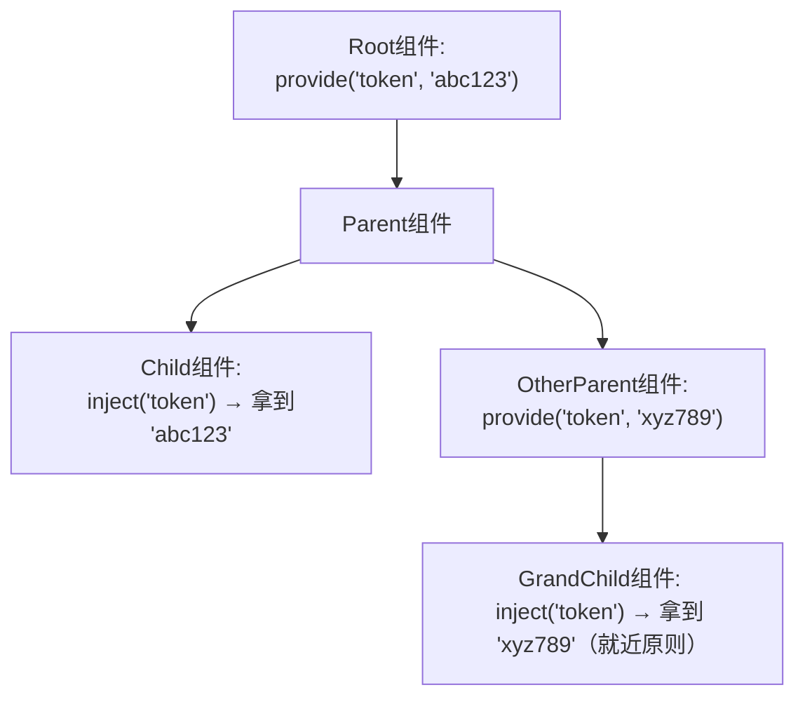
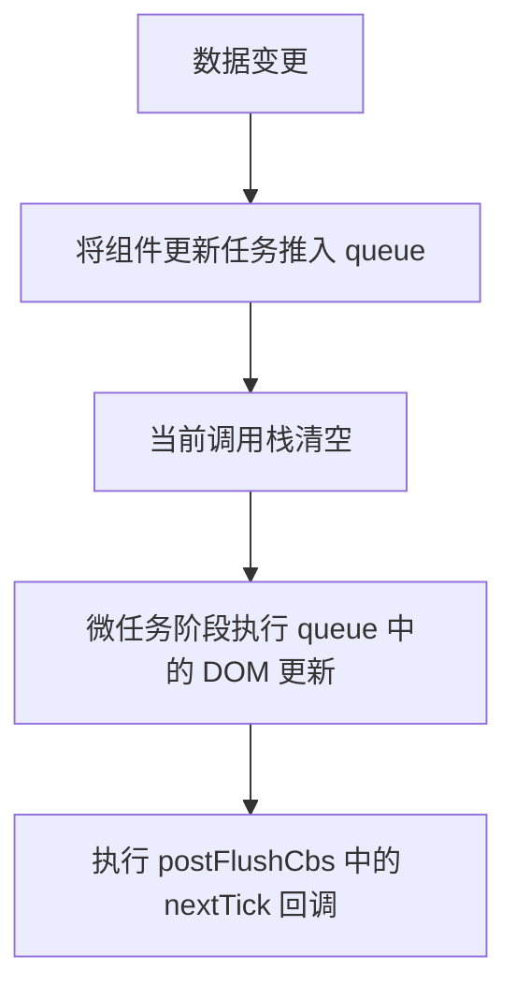

## 1 技术相关

### 1.1 对 SPA 的理解

- SPA（single-page application）单页应用，默认情况下我们编写Vue、React都只有一个 html 页面，并且提供一个挂载点，最终打包后会再此页面中引入对应的资源。（页面的渲染全部是由 JS 动态进行渲染的）。切换页面时通过监听路由变化，渲染对应的页面 Client Side Rendering，客户端渲染 CSR
- MPA（Multi-page application）多页应用，多个 html 页面。每个页面必须重复加载，js，css 等相关资源。（服务端返回完整的html，同时数据也可以再后端进行获取一并返回"模板引擎"）。多页应用跳转需要整页资源刷新。ServerSideRendering，服务器端渲染 SSR

1. 优缺点

|                 | 单页面应用（SPA）    | 多页面应用（MPA）                |
| --------------- | -------------------- | -------------------------------- |
| 组成            | 一个主页面和页面组件 | 多个完整的页面                   |
| 刷新方式        | 局部刷新             | 整页刷新                         |
| SEO搜索引擎优化 | 无法实现             | 容易实现                         |
| 页面切换        | 速度快，用户体验良好 | 切换加载资源，速度慢，用户体验差 |
| 维护成本        | 相对容易             | 相对复杂                         |

2. 解决方案

- 预编译 html，辅助 SEO 和首页白屏时间过长
- 采用 cdn
- SSR+CSR 结合，首屏使用服务端渲染，后续采用客户端渲染 NuxtJS


## 2 Vue 核心

### 前置知识

#### 组件与实例

在 Vue 中，`$parent`、`$children`和 `$root`是**组件实例属性**，用于访问组件的层级关系。它们反映了 Vue 的组件树架构。Vue 2 和 Vue 3 在访问方式上出现了一些区别，具体如下表：

| 属性            | 用途                                    | Vue 2 支持 | Vue 3 支持  | 注意事项                                                     |
| :-------------- | :-------------------------------------- | :--------- | :---------- | :----------------------------------------------------------- |
| **`$parent`**   | 访问**父组件实例**（直接上级）          | ✅          | ✅（但慎用） | 父组件可能动态变化（如 `v-if`切换），强耦合会导致代码脆弱    |
| **`$children`** | 访问**子组件实例数组**（直接下级）      | ✅          | ❌ 移除      | 顺序不保证与模板一致，且包含所有类型的 VNode（如普通元素）   |
| **`$root`**     | 访问**根组件实例**（最顶层的 Vue 实例） | ✅          | ✅           | 在多应用实例场景下（`createApp`多次调用），返回当前应用的根实例 |


在 Vue 2 中，普通组件是通过 `new VueComponent()`实例化的，会形成完整的组件实例树，对应地会将组件加入到`$parent`、`$children`属性中：

```javascript
// Vue 2 的组件实例关系
ParentComponent
├─ $children: [ChildComponentInstance]
ChildComponent
├─ $parent: ParentComponentInstance
```

但也有特例，函数式组件只是一个**渲染函数**，不会生成实例：

```javascript
// 函数式组件不会出现在 $children 中
ParentComponent
├─ $children: [] // 即使模板中有函数式组件，这里也是空的
```


> Vue 3 的普通组件也不再通过 `new` 创建实例，而是使用 `createVNode`+ `setup` 的组合式 API：
>
> ```javascript
> // Vue 3 的组件本质上是 VNode + 状态集合
> const vnode = createVNode(MyComponent, props)
> ```


可以在代码中访问这些属性：

```javascript
// 父组件
export default {
  mounted() {
    console.log(this.$children) // [子组件实例]
    this.$children[0].sayHello() // 调用子组件方法
  }
}

// 子组件
export default {
  methods: {
    sayHello() {
      console.log(this.$parent) // 父组件实例
      console.log(this.$root)   // 根实例
    }
  },
  abstract: true
}
```

如果不需要记录父子组件之间的关联关系，可以令 `abstract: true`


#### 虚拟 DOM 和真实 DOM

##### （1）基本概念

虚拟DOM（Virtual DOM）是前端框架（如 React、Vue 等）用来优化页面渲染性能的一种技术。它本质上是一个轻量级的 **JavaScript 对象**，用来描述真实 DOM 的结构和状态。

**真实 DOM**：浏览器中实际存在的树形结构（如 HTML 元素），操作成本高。

**虚拟 DOM**：框架内部维护的 JS 对象树，是真实 DOM 的抽象表示。

##### （2）工作流程

1. **初始化**：当数据变化时，框架会生成一个新的虚拟 DOM 树（VDOM）。
2. **对比（Diffing）**：比较新旧 VDOM 树的差异（React 的 Reconciliation / Vue 的 patching）。
3. **批量更新（Patching）**：仅将差异部分应用到真实 DOM，避免全量更新。

##### （3）常见问题

<Accordion label="在了解了虚拟 DOM 和真实 DOM 的概念后，很容易产生一个疑问，最终都是要调用 `document.*` 接口、进行重新渲染，又能够有多大好处？" group="2-0-2-3-1">

**核心观点：虚拟DOM的性能优势不在于它比直接操作DOM更快，而在于它提供了一种更智能、更高效的方式来<u>最小化对真实DOM的操作次数和范围</u>，从而在复杂应用中带来显著的性能提升。**

1. 的确，最终都需要操作真实 DOM 来更新界面，直接操作DOM（比如使用 `document.createElement`, `appendChild`, `innerHTML`或直接修改属性）在**非常小规模、简单**的更新上，可能比虚拟DOM更快，因为它避免了创建虚拟DOM树和Diff的过程。
2. **关键点在于 DOM 操作本身是非常昂贵的。** 浏览器渲染引擎的工作流程（布局计算、重绘、重排）代价高昂。频繁地、细粒度地直接修改 DOM，尤其是在复杂应用中，会导致大量的、不必要的重排和重绘，这是性能瓶颈的主要来源。
3. 使用虚拟 DOM 后有不可替代的场景优势：
    - 优势之一是**批处理**。当应用状态发生变化时，框架（如React）不会立即去修改真实DOM。它首先在内存中构建一个新的虚拟DOM树（这是一个轻量的JavaScript对象操作，非常快）；然后，框架会**比较（Diff）**新的虚拟DOM树和上一次渲染的旧虚拟DOM树，找出两者之间的**最小差异集**；最后，框架会将这些差异**打包成一个 patch，一次性应用**到真实DOM上。这大大减少了昂贵的DOM操作（重排/重绘）的触发次数。
    - 优势之二是**最小化变更**。Diff 算法的使用使得框架能够精确地计算出**哪些节点需要更新、添加或删除**，**只修改实际发生变化的部分**，避免了大量无谓的DOM操作
    - 优势之三是加强了应用的**跨平台性**。虚拟 DOM 是一个 JavaScript 对象树，它**抽象了渲染目标**。Vue 的核心算法（响应式、编译、虚拟 DOM Diff）并不直接依赖浏览器 DOM，这使得 Vue 能够通过不同的**渲染器 (Renderer)** 将虚拟 DOM 树渲染到不同平台，例如`@vue/runtime-dom` 渲染到浏览器 DOM，`@vue/runtime-test` 渲染到纯 JavaScript 对象，用于测试，`@vue/runtime-canvas` (社区或自定义) 渲染到 Canvas

</Accordion>


#### Vue 中的设计模式

- 单例模式：单例模式就是整个程序有且仅有一个实例（Vuex 中的 store）
- 工厂模式：传入参数即可创建实例（createElement）
- 发布订阅模式：订阅者把自己想订阅的事件注册到调度中心，当该事件触发时候，发布者发布该事件到调
  度中心，由调度中心统一调度订阅者注册到调度中心的处理代码（onCreated、emit）
- 观察者模式：watcher&dep的关系（与发布订阅模式的区别是，观察者模式是自发的，并非主动的发布、命令）
- 代理模式：代理模式给某一个对象提供一个代理对象，并由代理对象控制对原对象的引用（Vue 2 中通过访问 vm._data 去找 this.data）
- 装饰模式：Vue 2 装饰器的用法（对功能进行增强 @，类似于 Python 的装饰器，使用少，略）
- 中介者模式：中介者是一个行为设计模式通过提供一个统一的接口让系统的不同部分进行通信（Vuex）
- 策略模式：策略模式指对象有某个行为，但是在不同的场景中，该行为有不同的实现方案（mergeOptions）
- 外观模式：提供了统一的接口，用来访问子系统中的一群接口


### 2.1 对 Vue 的理解

按照官方而言，Vue 是一套用于构建用户界面的渐进式框架，Vue 的核心库值关注视图层

1. 声明式框架

命令式是例如以前 DOM 那样的，十分流程化；声明式则重点关注操作的过程，让开发核心回归到数据渲染和获取上

2. 借鉴 MVVM 模式

目的：职责划分、分层管理

简化、隐藏 controller，实现视图和数据的双向绑定，但是 Vue 并没有完全遵循，其中的 ref 直接就是典型例子

3. 采用虚拟 DOM

高效的虚拟DOM diff算法，优化渲染性能，避免重复、反复渲染

4. 组件化

提倡组件化开发模式，提高代码复用性和可维护性，降低每次重新渲染更新范围


### 2.2 Vue 2.0 和 Vue 3.0 的区别

（1）架构与性能优化

**响应式系统重写**

- **Vue 2.x**：使用 `Object.defineProperty` 实现响应式
    - 只能劫持对象的属性，需要递归遍历对象
    - 无法检测到对象属性的添加或删除
    - 对数组的变化需要通过重写数组方法实现

- **Vue 3.x**：使用 `Proxy` 实现响应式
    - 可以监听整个对象，不需要递归
    - 能检测到属性的添加和删除
    - 对数组的变化检测更自然

**虚拟 DOM 重写**

- 优化了 diff 算法，提升了渲染性能
- 编译时优化，生成更高效的代码

**更小的体积**

- Vue 3.0 核心库体积比 Vue 2.x 小约40%

- 通过 Tree-shaking 支持按需引入，未使用的功能不会打包


（2）Composition API

- **Vue 2.x**：Options API
    - 基于选项的组织方式 (data, methods, computed等)
    - 逻辑分散在不同选项中，大型组件难以维护

- **Vue 3.x**：引入Composition API
    - 基于函数的API，更好的逻辑复用
    - 相关逻辑可以组织在一起
    - 更灵活的代码组织方式
    - 更好的 TypeScript 支持

```vue
<!-- Vue2OptionsApi.vue -->
<template>
  <div>
    <p>{{ count }}</p>
    <button @click="increment">+1</button>
    <p>{{ doubleCount }}</p>
  </div>
</template>
<script>
export default {
  // 数据
  data() {
    return {
      count: 0
    }
  },
  // 计算属性
  computed: {
    doubleCount() {
      return this.count * 2
    }
  },
  // 方法
  methods: {
    increment() {
      this.count++
    }
  },
  // 生命周期
  mounted() {
    console.log('组件挂载完成')
  }
}
</script>
```


```vue
<!-- Vue3CompositionApi.vue-->
<template>
  <div>
    <p>{{ count }}</p>
    <button @click="increment">+1</button>
    <p>{{ doubleCount }}</p>
  </div>
</template>

<script>
import { ref, computed, onMounted } from 'vue'

export default {
  setup() {
    // 数据（响应式变量）
    const count = ref(0)
    // 计算属性
    const doubleCount = computed(() => count.value * 2)
    // 方法
    const increment = () => {
      count.value++
    }
    // 生命周期
    onMounted(() => {
      console.log('组件挂载完成')
    })
    // 暴露给模板
    return {
      count,
      doubleCount,
      increment
    }
  }
}
</script>
```

```vue
<!-- Vue3SetupAttr.vue -->
<script setup>
import { ref, computed, onMounted } from 'vue'
const count = ref(0)
const doubleCount = computed(() => count.value * 2)
const increment = () => {
  count.value++
}
onMounted(() => {
  console.log('组件挂载完成')
})
</script>
```

（3）TypeScript支持

- **Vue 2.x**：对 TypeScript 支持有限
    - Options API 设计导致类型推断困难
    - 需要依赖 `vue-class-component` 等装饰器

- **Vue 3.x**：完全用 TypeScript 重写
    - 提供更好的类型推断
    - Composition API 天然适合 TypeScript
    - 开发体验大幅提升


（4）其他新特性

**片段(Fragments)**

- Vue 2.x：组件模板必须有单个根节点
- Vue 3.x：支持多根节点模板

```vue
<template>
  <header>Header</header>
  <main>Main Content</main>
  <footer>Footer</footer>
</template>
```

**内置内置组件：Teleport 组件**

[Teleport | Vue.js](https://cn.vuejs.org/guide/built-ins/teleport.html)

- 新增`<teleport>`组件，可以将子节点渲染到DOM中的其他位置

```vue
<template>
  <button @click="showModal = true">Open Modal</button>
  <Teleport to="body">
    <Modal v-if="showModal" @close="showModal = false" />
  </Teleport>
</template>
```

**内置内置组件：Suspense 组件**

[Suspense | Vue.js](https://cn.vuejs.org/guide/built-ins/suspense.html)

- 新增实验性的`<Suspense>`组件，可以处理异步依赖

```vue
<template>
  <Suspense>
    <template #default>	<!--向Suspense中的名字为default的插槽插入内容-->
      <AsyncComponent />
    </template>
    <template #fallback> <!--向Suspense中的名字为fallback的插槽插入内容-->
      <div>Loading...</div>
    </template>
  </Suspense>
</template>
```


（5）生命周期名称变化

- Vue 3.x 生命周期钩子名称变化：
    - `beforeDestroy` → `beforeUnmount`
    - `destroyed` → `unmounted`

- 新增`renderTracked`和`renderTriggered`调试钩子

详细见 [2.12](#2-12-Vue-的生命周期与用法)


**6. 全局API变化**

- Vue 2.x 的全局API（如`Vue.nextTick`）现在通过应用实例调用
- 创建应用方式变化：

```javascript
// Vue 2.x
new Vue({...})

// Vue 3.x
import { createApp } from 'vue'
const app = createApp({...})
```

**7. 自定义渲染器API**

- Vue 3.x 提供了自定义渲染器API
- 可以创建针对不同平台的渲染器（如小程序、Canvas等）

**8. 迁移兼容性**

- Vue 3.x 保持了大部分Vue 2.x的语法兼容
- 提供了迁移构建版本和兼容插件
- 官方提供了详细的迁移指南

**9. 总结对比表**

| 特性           | Vue 2.x               | Vue 3.x                       |
| -------------- | --------------------- | ----------------------------- |
| 响应式系统     | Object.defineProperty | Proxy                         |
| API风格        | Options API           | Options API + Composition API |
| TypeScript支持 | 有限                  | 优秀                          |
| 体积           | 较大                  | 小约40%                       |
| 虚拟DOM        | 传统实现              | 优化后的实现                  |
| 片段支持       | 不支持                | 支持                          |
| 全局API        | 全局Vue对象           | 应用实例                      |
| 生命周期       | 传统命名              | 部分重命名                    |
| 自定义渲染     | 有限支持              | 强大API                       |

Vue 3.0 在性能、开发体验和可维护性方面都有显著提升，特别是对于大型复杂应用，Composition API 提供了更好的代码组织方式。


### 2.3 为什么用虚拟 DOM

- Virtual DOM 就是**用 JS 对象来描述真实DOM**，是对真实 DOM 的抽象，由于直接操作 DOM 性能低但是 JS 层的操作效率高，可以将 DOM 操作转化成对象操作，最终通过 diff 算法比对差异进行更新 DOM（减少了对真实DOM的操作）。
- 虚拟DOM不依赖真实平台环境从而也可以实现跨平台。

1. vnode 的生成

template 经过 Vue 模板编译器会转换为渲染函数 render；在接下来的挂载过程中会调用 render 函数，返回的对象就是虚拟 DOM；会在后续的 patch 过程中进一步转化为真实 DOM。

> VNode 的类型
>
> - 元素节点：描述 DOM 元素
> - 文本节点：纯文本内容
> - 组件节点：Vue 组件实例
> - 注释节点：模板中的注释
> - 克隆节点：用于优化静态节点和插槽

2. diff 算法

Vue 的 diff 算法是基于 Snabbdom 改进而来，是一种高效的虚拟 DOM 比较算法，主要特点：

- 同级比较（不跨层级）

- 双端比较（同时从新旧 children 的两端开始比较）

- key 的重要性（帮助识别节点身份）

    1. **Vue 2**：
        - 全量 Diff
        - 双端比较算法
        - 没有静态节点优化

    2. **Vue 3**：
        - 引入静态提升 (hoistStatic)
        - 使用 PatchFlags 标记动态节点
        - 区块树优化，减少比较范围
        - 事件缓存优化


### 2.4 对 Vue 组件化的理解

组件化好处：高内聚、可重用、可组合

- 组件化开发能大幅提高应用开发效率、测试性、复用性等；
- 降低更新范围，只重新渲染变化的组件；

对于 Vue

- Vue 中的每个组件都有一个渲染函数watcher、effect。
- 数据是响应式的，数据变化后会执行watcher或者effect。
- 组件要合理的划分，如果不拆分组件，那更新的时候整个页面都要重新更新。
- 如果过分的拆分组件会导致watcher、effect产生过多也会造成性能浪费。


### 2.5 Diff 算法

#### 2.5.1 既然Vue通过数据劫持可以精准探测数据变化，为什么还需要虚拟DOM进行diff检测差异?

标准回答：

1. Vue 能精准探测数据变化，但是**不能得知数据变化后组件如何渲染**。

   首先，Vue 的响应式系统追踪的是**组件实例对数据的依赖**。当一个响应式数据变化时，Vue 知道哪些组件实例需要重新渲染（`render`函数需要重新执行）。

   接着，**`render`函数生成的是整个组件的 VNode 树：** 组件的 `render`函数（无论是模板编译而来还是手写的）负责描述该组件**当前状态**下应该呈现的整个视图结构。它输出的是一个完整的**虚拟 DOM 树 (VNode Tree)**，代表该组件的 UI。

   总结：响应式系统**只能知道哪些数据发生了变化**，**只能知道哪些组件脏了**，但**不知道选然后组件会发生什么变化**，一个数据变化可能影响多个 DOM 节点，也可能多个数据变化只影响一个 DOM 节点，特别是对于数组更新的场景，结果更加不可预知，则还需要通过 diff 算法进一步计算得到 patch。

2. 要实现题目那样的做法，也就是说对每一个属性都要准备一个 watcher，但是页面上面可能会有很多很多个属性，这样内存消耗巨大

所以折中的方案就是两者分工——

1. **响应式系统**：
    - 追踪数据依赖
    - 通知组件“需要重新渲染”
2. **虚拟 DOM + Diff**：
    - 生成新的虚拟 DOM 树
    - 对比新旧虚拟 DOM
    - 计算最小 DOM 操作
    - 执行实际 DOM 更新


深入思考：

1. 响应式系统中，只知道响应式数据和组件之间的关系，不明确响应式数据和具体 DOM 之间的关联
2. 一有变化，重新渲染一个虚拟 DOM 树，但是经过 diff 算法后再实际渲染


#### 2.5.2 Vue 的 Diff 算法原理


#### 2.5.3 key 属性

概念：

- key 主要用在 Vue 的虚拟 DOM 算法，在新旧 nodes 对比时以此辨识 VNodes。如果不使用 key，Vue 会使用一种最大限度减少动态元素，并且尽可能地尝试就地修改/复用相同类型元素的算法（diff 算法）。
- 当 Vue 正在更新使用 v-for 渲染的元素列表时，它默认使用“就地更新”的策略。如果数据项的顺序被改
  变，Vue 将不会移动 DOM 元素来匹配数据项的顺序，而是**就地更新（不是移动）**每个元素，并且确保它们在每个索引位置正确渲染

作用：

- Vue 在 patch 过程中通过 key 可以判断两个虚拟节点是否是相同节点。（可以复用老节点）
- 无 key 会导致更新的时候出问题
- 尽量不要采用索引作为 key


### 2.6 怎么理解响应式数据

响应式数据是指当数据发生变化时，所有依赖该数据的地方都会自动更新。在 Vue 中表现为：

- 数据变化 → 视图自动更新
- 表单输入 → 数据自动同步

响应式系统的关键组成部分：

1. 数据劫持（Data Hijacking）

Vue 2 使用 `Object.defineProperty` 来实现数据劫持：遍历、重写 data 对象的所有属性，转换为 getter/setter ，在 getter 中收集依赖（Watcher），在 setter 中通知依赖更新。

- **无法检测对象属性的添加/删除**（需要使用 Vue.set/Vue.delete）
- **数组变化需要特殊处理**（重写数组方法）
- **性能开销**：需要递归遍历所有属性，对于 array，需要自行重写array 的监听逻辑，且不支持 map、set 等 ES6 的数据结构

Vue 3 使用 ES6 的 Proxy 重构响应式系统：

- **全面拦截**：可以检测各种类型的操作（属性增删、数组索引变化等）
- **性能更好**：惰性响应，不需要初始化时递归转换
- **更丰富的拦截操作**：支持 has、ownKeys 等操作

2. 依赖收集（Dependency Tracking）

- **Dep 类**：每个响应式属性（即 data 区中的每个实例内部）都有一个 Dep 实例，为依赖收集器
- **Watcher**：代表一个依赖，通常是组件渲染函数或计算属性

3. 工作流程详解

- **组件初次渲染**：
    - 组件渲染读取数据，触发数据的 getter

    - 数据将当前 Watcher 注册到自己属性的 Dep 中

- **数据变更时**：
- 修改数据触发 setter

- 数据通知 Dep 中的所有 Watcher 更新

- Watcher 触发组件重新渲染

4. 响应式数据类型

- **普通数据**：通过 reactive/ref 创建
- **计算属性**：基于其他响应式数据计算得出
- **ref**：处理基本类型值的响应式包装
- **reactive**：处理对象的深度响应式转换


#### 2.6.1 怎么检测数组变化

数组考虑性能原因没有用 defineProperty 对数组的每一项进行拦截，Vue 2 选择重写数组数组的 push, shift, pop, splice, unshift, sort, reverse 等会改变数组的方法，官方也称这些方法为变异方法。

数组中如果是对象数据类型也会进行递归劫持

缺点，无法监控数组的索引和长度变化


#### 2.6.2 computed 和 watch

Vue2 中有三种 watcher (渲染 watcher、计算属性 watcher、用户 watcher）

Vue3 中有三种 effect（渲染 effect、计算属性 effect、用户 effect）

1. computed

- 计算属性仅当用户取值时才会执行对应的方法。
- computed属性是**具备缓存**的，依赖的值不发生变化，对其取值时计算属性方法不会重新执行。
- 计算属性可以简化模板中复杂表达式。
- 计算属性中不支持异步逻辑。
- computed属性是可以再模板中使用的。

2. watch

watch 则是监控值的变化，当值发生变化时调用对应的回调函数。经常用于监控某个值的变化，进行一些操作。(异步要注意竞态问题）


#### 2.6.3 provide 和 inject

组件树的某个**上层组件**（不能同层）中调用了 `provide`，任何位于其**下层的组件**（无论嵌套多深）都可以通过 `inject`获取该值。这是 Vue 的依赖注入系统的核心设计。

- `provide`提供的数据会向下**穿透所有子组件树**，无论嵌套多少层。
- 子组件通过 `inject`可以获取**最近的**上层祖先提供的同名值。



在 Vue 3 的多应用模式下（多个 `createApp`），`provide`的数据**仅对当前应用树有效**。


### 2.8 ref 和 reactive 的区别

这两个概念存在于 Vue 3

- reactive 用于处理**对象类型**的数据响应式。底层采用的是 new Proxy()，注意，proxy 只能代理对象，不能代理基本类型
- ref 通常用于处理**单值**的响应式，ref 主要解决原始值的响应式问题。底层采用的是 reactive，转换源码如下：[ref 对象的构造]([ref.ts - vuejs/core - GitHub1s](https://github1s.com/vuejs/core/blob/main/packages/reactivity/src/ref.ts#L117-L121)) -> [ref 内部的 value 是一个 Proxy]([reactive.ts - vuejs/core - GitHub1s](https://github1s.com/vuejs/core/blob/main/packages/reactivity/src/reactive.ts#L421-L422))

如果 ref(对象)，那么返回的对象的 value 是一个 Proxy；

如果 reactive({"key1": "v1", "k2": ref(单值)})，调用返回值的k2时会自动拆包，不用返回值.k2.value（数组除外）


### 2.9 watch 和 watchEffect

底层都是基于ReactiveEffect(getter, scheduler)

- watchEffect 立即运行一个函数，然后被动地追踪它的依赖，当这些依赖改变时重新执行该函数。

    - 什么时候用？当一次性依赖很多状态值，每有一个变动都要全部执行相同的逻辑

    - 用法

      ```js
      watcheffect(() => {
          app.innerHTML = state.name;
          // 数据变化后，会调用scheduler内部会再次触发effect.run（）重新运行getter
      });
      ```

- watch 侦测一个或多个响应式数据源并在数据源变化时调用一个回调函数。

    - 什么时候用？需要取得特定的变化的值做特定的处理

    - 用法

      ```js
      watch(
          () => state.name,
          (newval，o1dval)=>{}	//数据变化后，会调用scheduler，内部会调用cb
      );
      ```


### 2.10 如何将 template 转换为 render 函数

Vue 中含有模版编译的功能，它的主要作用是将用户编写的 template 编译为 js 中可执行的 render 函数。

Vue 2 过程：

- 将 template 模板转换成 ast 语法树 - parserHTML
- 遍历抽象语法树，对静态语法做静态标记 - markupdiff 来做优化的静态节点跳过diff操作
- 重新生成代码 - codeGen


Vue 3 过程：

- 将 template 模板转换成 ast 语法树 + 大量优化 - parserHTML
- 大量优化
- 重新生成代码


方法：

使用全量的带 Vue.compile 函数的包


### 2.11 new Vue() 发生了什么

- 在 `new Vue()` 的时候内部会进行初始化操作。
- 内部会初始化组件绑定的事件，初始化组件的父子关系 `$parent` `$children` `$root`
- 初始化响应式数据data、computed、props、watch、method。同时也初始化了 provide 和 inject 方法。内部会对数据进行劫持对象采用 defineProperty 数组采用方法重写。
- 再看用户是否传入了 el 属性和 template 或者 render。render 的优先级更高，如果用户写的是
  template，会做模板编译（三部曲）。最终就拿到了 render 函数
- 内部挂载的时候会产生一个 watcher，会调用 render 函数会触发依赖收集。内部还会给所有的响应式数据增加 dep 属性，让属性记录当前的 watcher（用户后续修改的时候可以触发 watcher 重新渲染）
- vue 更新的时候采用虚拟 DOM 的方式进行 diff 算法更新。


### 2.12 Vue 的生命周期与用法

| **阶段**       | **Vue2 钩子** | **Vue3 钩子**       | **触发时机**                                        | **典型业务场景**                                 |
| :------------- | :------------ | :------------------ | :-------------------------------------------------- | :----------------------------------------------- |
| **初始化阶段** | beforeCreate  | 无（被 setup 替代） | 实例初始化后，数据观测/事件配置前                   | 极少使用，可做不依赖数据的插件初始化             |
|                | created       | setup()             | 实例创建完成，数据观测/属性/方法/watch/event 已配置 | 发起异步请求、初始化非响应式变量、访问 data 数据 |
| **挂载阶段**   | beforeMount   | onBeforeMount       | 挂载开始前，render 函数首次调用                     | 服务端渲染特殊处理                               |
|                | mounted       | onMounted           | 实例挂载到 DOM 后                                   | 操作 DOM、初始化第三方库、添加事件监听           |
| **更新阶段**   | beforeUpdate  | onBeforeUpdate      | 数据变化后，虚拟 DOM 重新渲染前                     | 获取更新前 DOM 状态、移除事件监听                |
|                | updated       | onUpdated           | 数据变化导致虚拟 DOM 重新渲染并打补丁后             | 执行 DOM 相关操作（需避免无限循环）              |
| **销毁阶段**   | beforeDestroy | onBeforeUnmount     | 实例销毁前                                          | 清除定时器、取消事件监听、取消网络请求           |
|                | destroyed     | onUnmounted         | 实例销毁后                                          | 最终清理工作、记录销毁日志                       |
| **错误处理**   | 无            | onErrorCaptured     | 捕获后代组件错误时                                  | 错误边界处理、发送错误日志                       |
| **调试钩子**   | 无            | onRenderTracked     | 开发模式：跟踪虚拟 DOM 渲染依赖的响应式数据         | 性能调试                                         |
|                | 无            | onRenderTriggered   | 开发模式：跟踪触发虚拟 DOM 渲染的响应式数据         | 响应式依赖调试                                   |


Vue 2：


Vue 3：


### 2.13 其他 Vue 指令/接口

#### 2.13.1 Vue.set

[Vue.set 源代码](https://github1s.com/vuejs/vue/blob/main/src/core/observer/index.ts#L223-L276)

##### （1）解决的问题

`Vue.set` 存在的核心是解决目标对象的**属性不是响应式、添加的属性无法变成响应式**的问题。

由于 Vue 2 使用 `Object.defineProperty`实现响应式，但**无法检测对象属性的新增或删除**。直接赋值新属性 (`obj.newProp = value`) 不会触发更新 ，因而必须借助其他手段实现新属性的监听。

##### （2）工作流程

1. 参数校验：首先会检查所给的目标对象是否合法——是否为空或是否为基础类型

    - 如果是目标对象是数组，则使用自己 Vue 重写后的 splice 方法，修改数组属性的同时通知视图更新
    - 如果属性本身就具有这个属性，则直接添加

2. 取目标对象的 `__ob__` 属性，为后续判定是否响应式、和获取响应式配置参数做准备

3. 修改目标对象的属性

    - 如果目标对象的属性是数组，首先调整数组长度确保索引有效；使用 `splice` 修改数组（Vue 2 重写了 `splice`，能触发响应式更新）；如果是 SSR 的 mock 模式且非浅响应式，对新值进行响应式处理

    - 如果目标对象的属性是否已存在于目标对象（且**非原型链上的属性**），直接赋值（setter 会自动触发响应式更新）

      > Vue 2中若继承了别人的属性，第一次读的时候读的是链上的；第一次写的时候会自动创建一个响应式的，并且”遮蔽“链上的同名属性（走的是这里文档描述的最后一条逻辑）。

- 如果目标对象是Vue 实例或根级 `data`对象，警告，不操作

- 如果目标对象不是响应式的，直接赋值（也不管渲染问题了）

- 如果目标对象均不符合上述条件，则把将要赋予的属性（新属性）定义成响应式的，随后通知视图更新

##### （3）示例代码

```javascript
const vm = new Vue({
  data: { user: { name: 'Alice' } }
});
// ❌ 错误：不会触发响应式更新
vm.user.age = 25; 

// ✅ 正确：使用 Vue.set
Vue.set(vm.user, 'age', 25);
```

```javascript
// ❌ 错误：直接通过索引修改数组不会触发更新
vm.items[0] = { id: 100 };

// ✅ 正确
Vue.set(vm.items, 0, { id: 100 });
```


#### 2.13.2 Vue.observable

Vue 2.6 新增接口，**让一个普通对象变成响应式对象**，可以不存在于一个组件的 data 属性中，使得一整个应用都共享同一个对象。通常用于避免使用大型状态管理工具的场景。

示例：

1. 创建跨组件的响应式状态

```javascript
// store.js
export const state = Vue.observable({
  count: 0,
  todos: []
});

// 组件中使用
import { state } from './store';
export default {
  computed: {
    count() { return state.count; }
  },
  methods: {
    increment() { state.count++; } // 触发视图更新
  }
}
```

2. 替代 Event Bus 的简单状态共享

```javascript
// 创建响应式全局状态
const globalState = Vue.observable({ theme: 'light' });

// 所有组件可读写
globalState.theme = 'dark'; // 自动触发依赖更新
```

> Vue 2 文档：[API — Vue.js](https://v2.cn.vuejs.org/v2/api/#实例方法-事件)
>
> Vue 3 迁移文档：[事件 API | Vue 3 迁移指南](https://v3-migration.vuejs.org/zh/breaking-changes/events-api.html#_2-x-syntax)
>
> Event Bus（事件总线） 是一种设计模式，适用于**非父子组件或跨层级组件**之间的通信。它本质上是一个中央事件系统，允许组件通过发布/订阅模式进行通信。
>
> 核心概念：
>
> - 发布者（Publisher）：触发事件的组件
> - 订阅者（Subscriber）：监听并响应事件的组件
> - 事件中心（Event Bus）：管理事件发布和订阅的中央枢纽
>
> Vue 2 中，Vue 实例内部实现了这样的一个事件总线，可以使得在整个程序中任一处调用相关接口对总线中的数据进行操作：
>
> | 方法    | 描述     | 示例                                     |
> | :------ | :------- | :--------------------------------------- |
> | `$on`   | 监听事件 | `EventBus.$on('event-name', callback)`   |
> | `$emit` | 触发事件 | `EventBus.$emit('event-name', data)`     |
> | `$off`  | 取消监听 | `EventBus.$off('event-name', callback)`  |
> | `$once` | 监听一次 | `EventBus.$once('event-name', callback)` |
>
> 由于全局总线不利于维护项目，Vue 3 中移除了对事件总线及相关方法的实现，但保留了 `emit` 用于父子组件之间的通信，也因而本文不再对其进行分析。
>
> 如仍有需要，可以使用外部的、实现了事件触发器接口的库，例如 mitt 或 tiny-emitter


#### 2.13.3 Vue.use

仅 Vue2；Vue3 需要使用 `app.use()`，app 是一个 vue 应用实例；

##### （1）基本概念

安装 Vue.js 插件。如果插件是一个对象，必须提供 install 方法。如果插件是一个函数，它会被作为 install 方法。install 方法被调用时，会将 Vue 作为参数传入，这样插件中就不再需要导入 Vue 或自行创建一个 Vue 实例了。

##### （2）应用场景

- 添加全局指令、全局过滤器、全局组件。
- 通过全局混入来添加一些组件选项。
- 添加 Vue 实例方法，通过把它们添加到 Vue.prototype 上实现。

##### （3）实现原理（待补充）


#### 2.13.4 Vue.extend

仅 Vue2；Vue3 需要从 Vue 中导入使用 `defineComponent()`；

##### （1）基本概念

使用基础 Vue 构造器，创建一个继承自 Vue 基类的“子类”。参数是一个包含组件选项的对象。它允许你基于 Vue 构造器创建一个可复用的组件定义，而不是直接创建一个组件实例。

- **组件构造器**：返回的是一个构造函数，不是组件实例
- **继承机制**：创建的构造器继承自 Vue 基类
- **可复用性**：可以多次实例化创建多个组件实例

##### （2）代码示例

1. 基本语法

```javascript
// 创建组件构造器
const MyComponent = Vue.extend({
  // 组件选项
  template: '<div>{{ message }}</div>',
  data() {
    return {
      message: 'Hello from Vue.extend!'
    }
  }
})

// 实例化组件
const instance = new MyComponent()

// 挂载到DOM
instance.$mount('#app')
```

2. 创建可复用的组件构造器

```javascript
const Button = Vue.extend({
  template: '<button :class="type"><slot></slot></button>',
  props: ['type']
})

// 创建多个实例
const primaryBtn = new Button({ propsData: { type: 'primary' } })
const dangerBtn = new Button({ propsData: { type: 'danger' } })
```

3. 继承与扩展

```javascript
// 基础组件
const BaseComponent = Vue.extend({
  data() {
    return { baseData: 'Base data' }
  }
})

// 扩展基础组件
const ExtendedComponent = BaseComponent.extend({
  data() {
    return { extendedData: 'Extended data' }
  }
})
```

4. 动态组件创建

```javascript
// 动态创建弹窗组件
function createModal(content) {
  const Modal = Vue.extend({
    template: `
      <div class="modal">
        <div class="modal-content">{{ content }}</div>
        <button @click="close">Close</button>
      </div>
    `,
    props: ['content'],
    methods: {
      close() {
        this.$destroy()
        this.$el.remove()
      }
    }
  })
  
  const instance = new Modal({ propsData: { content } })
  instance.$mount()
  document.body.appendChild(instance.$el)
}
```


##### （3）用法分析

- **所有的组件创建时**都会调用 Vue.extend 方法进行创建
- 有了此方法我们可以用于手动挂载组件。
- 后端存储的字符串模板我们可以通过 Vue.extend 方法将其进行渲染，但是需要引入编译时。


#### 2.13.5 Vue.filter

仅 Vue2；Vue3废除

Vue 2 中有这种语法，过滤器实质不改变原始数据，只是对数据进行加工处理后返回过滤后的数据再进行调用处理，我们也可以理解成纯函数。

```vue
{{ message I filterA("argl", "arg2") I filterB("argl", "arg2") }}
```

```js
Vue.filter('filterA', function (value){
	//返回处理后的值  全局过滤器
})
Vue.filter('filterB', function (value) {
	//返回处理后的值
})
```

常用于单位转换、千分符、文本格式化、时间格式化等操作。Vue3 废除，可阅读性很差，使用 computed 实现更合适


#### 2.13.6 Vue.mixin

##### （1）基本概念

`Vue.mixin` 可以用来扩展组件，将公共逻辑进行抽离（写好一个公用组件A，含 template data component 等，使用 `Vue.mixin` 后可以选择和全局所有组件，或是和某一组件合并/混入到一起）。例如：

```javascript
// 定义 mixin
const myMixin = {
  data() {
    return { sharedData: '混入的数据' }
  },
  created() {
    console.log('混入的 created 钩子')
  },
  methods: {
    sharedMethod() {
      console.log('混入的方法')
    }
  }
}

// 在组件中使用
Vue.component('my-component', {
  mixins: [myMixin], // 局部混入
  created() {
    console.log('组件自身的 created 钩子')
  }
})

// 全局混入（慎用！）
Vue.mixin({ /* 全局选项 */ })
```

Vue3 中，取消了单独组件的混入，只允许应用级的混入，即只有：

```javascript
import { createApp } from 'vue'

const myMixin = {
  // 选项同 Vue 2
}

const app = createApp({
  mixins: [myMixin]
})

// 应用级混入
app.mixin({ /* 应用级选项 */ })
```


##### （2）工作原理

选项合并：当组件和 Mixin 有同名选项时，Vue 按以下规则合并：

| 选项类型         | 合并策略                                               |
| :--------------- | :----------------------------------------------------- |
| **`data`**       | 递归合并，组件数据优先（冲突时覆盖混入数据）           |
| **生命周期钩子** | 合并为数组，混入的钩子**先执行**，组件自身的钩子后执行 |
| **`methods`**    | 合并为对象，组件方法优先（冲突时覆盖混入方法）         |
| **`computed`**   | 合并为对象，组件方法优先（冲突时覆盖混入方法）         |


##### （3）示例代码

```javascript
const mixin = {
  data() { return { foo: 'mixin foo', bar: 'mixin bar' } },
  created() { console.log('mixin created') }
}

new Vue({
  mixins: [mixin],
  data() { return { foo: 'component foo' } },
  created() { console.log('component created') }
})

// 输出顺序：
// 'mixin created'
// 'component created'
// 合并后的 data: { foo: 'component foo', bar: 'mixin bar' }
```

自定义合并策略：Vue 允许通过 `config.optionMergeStrategies`自定义合并逻辑（仅 Vue 2）：

```javascript
Vue.config.optionMergeStrategies.myOption = (parentVal, childVal) => {
  return childVal || parentVal
}
```


##### （4）缺点及最佳用法

- 命名冲突：混入和组件同名属性/方法会被覆盖，难以调试。

```
// mixin.js
export default { methods: { submit() { /* ... */ } } }

// 组件中
methods: { submit() { /* 覆盖混入方法 */ } } // 静默覆盖！
```

- 隐式依赖：混入的逻辑可能依赖组件中的特定属性，但缺乏显式声明。

```
// mixin 假设组件有 this.userId
methods: { fetchData() { return axios.get(`/user/${this.userId}`) } }
```

- 全局混入的污染：Vue 2 的 `Vue.mixin()`会影响所有组件，可能导致意外行为。

- 调试困难：混入的逻辑分散在多个文件中，错误堆栈不易追踪。

Vue3 最佳实践

则若需要提取公共项目，最好使用 Vue3 的 Composition API 和导入。Composition API 允许将**数据、方法、生命周期打包**为一个自包含的单元。例如：

```javascript
// composables/useDateTime.js
import { ref, onMounted, onUnmounted } from 'vue'

export function useDateTime() {
  const now = ref(new Date())

  const formatDate = (date) => new Date(date).toLocaleString()

  const timer = setInterval(() => {
    now.value = new Date()
  }, 1000)

  onUnmounted(() => clearInterval(timer))

  return { now, formatDate }
}

// 组件中使用
import { useDateTime } from './composables/useDateTime'
export default {
  setup() {
    const { now, formatDate } = useDateTime()
    return { now, formatDate }
  }
}
```


#### 2.13.6 slot 插槽

1. 概念

插槽设计来源于 Web Components 规范草案，利用 slot 进行占位，在使用组件时，组件标签内部内容会分
发到对应的 slot 中。

2. 场景

通过插槽可以让用户更好的对组件进行扩展和定制化。可以通过具名插槽指定渲染的位置。常用的组件例
如：弹框组件、布局组件、表格组件、树组件……

3. 分类和原理

- 默认插槽

不给名字即可，名字就默认为 default

- 具名插槽

**父组件渲染**后，根据 slot="name" 将东西放到相同名称的占位符上面，是一个父子组件之间的映射

```vue
<!-- NormalSlot.vue -->
<template>
    <div>
        <slot name="title"></slot>
        <slot name="content"></slot>
    </div>
</template>
```

```vue
<NormalSlot>
	<h slot="title">标题</h1>
	<div slot="content">内容</div>
</NormalSlot>
```

- 作用域插槽

将核心数据交给子组件，子组件处理完成后会去调用父组件的对应的函数，随后放到**子组件中进行渲染**

```vue
<!-- Scopeslot.vue -->
<template>
    <div>
        <slot :article="{title: '标题’,content:'内容'}"></slot>
    </div>
</template>
```

```vue
<Scopeslot>
    <template v-slot="{article}">
		<!-- 编译后，h1和div会放到一个函数里面，等待article被处理完成后在被调用才渲染这个DOM -->
        <h1>{{article.title}}</h1>
        <div>{{article.content}}</div>
    </template>
</ScopeSlot>
```


#### 2.13.7 双向绑定：v-model 和 .sync 修饰符

1. 概念

vue中双向绑定靠的是指令v-model，可以绑定一个动态值到视图上，同时修改视图能改变数据对应的值（能
修改的视图就是表单组件） 经常会听到一句话：v-model 是 value + input 的语法糖，但并不完全正确。

2. 表单元素中的 v-model
   内部会根据标签的不同解析出不同的语法。并且这里有“额外“的处理逻辑，例如对于中文或需要文本合成系统的字符的处理

    - 例如文本框会被解析成value+input事件
    - 例如复选框会被解析成checked+change事件

3. 组件上的 v-model 默认会利用名为 value 的 prop 和名为 input 的事件。 对于组件而言 v-model 就是
   value+input的语法糖。可用于组件中数据的双向绑定。

   名字也可以修改。

   Vue2中修改名字和双向绑定多个数据

   ```js
   Vue.component('base-checkbox',{
   	model:{
   		prop:'checked'
   		event:'change'
   	},
   	props: {
   		checked:Boolean
   	},
   	template: `
           <input
               type="checkbox"
               v-bind:checked="checked"
               v-on:change="$emit('change', $event.target.checked)"
           />
   	`
   })
   ```

   ```vue
   <myComponent :a.sync="a" :b.sync="b" :c.sync="c"></myComponent>
   ```

   ```vue
   <!-- myComponent.vue -->
   <template>
       <div>
           <button @click="$emit('update:a', 100)">a的内容 {{a}}</button>
           <button @click="$emit('update:b', 100)">a的内容 {{b}}</button>
       </div>
   </template>
   
   <script>
   export default {
       props:{
           a: Number,
           b:Number
       }
   }
   </script>
   ```


Vue3中修改名字和双向绑定多个数据（.sync在Vue3中已废除）

   ```vue
   <myComponent v-model:a="a" v-model:b="b" v-model:c="c"></myComponent>
   ```


#### 2.13.8 修饰符


**1. 事件修饰符（Event Modifiers）**

用于处理 DOM 事件，通常用在 `v-on`（或 `@`）指令上。

- **`.stop`**
  阻止事件冒泡（相当于 `event.stopPropagation()`）。

  ```vue
  <button @click.stop="handleClick">点击不会冒泡</button>
  ```

- **`.prevent`**
  阻止默认行为（相当于 `event.preventDefault()`）。

  ```vue
  <form @submit.prevent="handleSubmit">提交不会刷新页面</form>
  ```

- **`.capture`**
  使用事件捕获模式（而非冒泡模式）。

  ```vue
  <div @click.capture="handleCapture">捕获阶段触发</div>
  ```

- **`.self`**
  只有当事件是从当前元素触发时才执行（忽略子元素冒泡）。

  ```vue
  <div @click.self="handleSelf">只有点击 div 本身才触发</div>
  ```

- **`.once`**
  事件只触发一次。

  ```vue
  <button @click.once="handleOnce">仅生效一次</button>
  ```

- **`.passive`**
  提升滚动性能（适用于 `touch` 或 `wheel` 事件，与 `prevent` 冲突）。

  ```vue
  <div @touchmove.passive="handleTouch">优化移动端滚动性能</div>
  ```

**2. 按键修饰符（Key Modifiers）**

用于监听键盘事件（如 `@keyup`、`@keydown`）。

- **`.enter`**
  只在按下 `Enter` 键时触发。

  ```vue
  <input @keyup.enter="submitForm" />
  ```

- **`.esc`、`.tab`、`.space`、`.up`、`.down`、`.left`、`.right`**
  监听特定按键。


  ```vue
<input @keyup.esc="closeModal" />
  ```


- **自定义按键码（Vue 2）或按键别名（Vue 3）**
  Vue 2 支持按键码（已废弃），Vue 3 推荐使用 [`KeyboardEvent.key`](https://developer.mozilla.org/en-US/docs/Web/API/KeyboardEvent/key) 值。


  ```vue
<input @keyup.page-down="nextPage" /> <!-- Vue 3 支持 -->
  ```

**3. 表单输入修饰符（Form Modifiers）**

用于 `v-model` 双向绑定，控制输入行为。

- **`.lazy`**
  输入框失焦时更新数据（默认是 `input` 事件触发）。

  ```vue
  <input v-model.lazy="message" /> <!-- 改为 change 事件触发 -->
  ```

- **`.number`**
  将输入转为数字类型（否则默认是字符串）。

  ```vue
  <input v-model.number="age" type="number" />
  ```

- **`.trim`**
  自动去除输入的首尾空格。

  ```vue
  <input v-model.trim="username" />
  ```

**4. 鼠标按键修饰符（Mouse Button Modifiers）**

用于监听特定鼠标按键（如 `@click`）。

- **`.left`、`.right`、`.middle`**
  限制鼠标左键、右键或中键触发。

  ```vue
  <button @click.right="showContextMenu">右键菜单</button>
  ```

**5. 系统修饰键（System Modifiers）**

组合按键触发（如 `Ctrl`、`Shift` 等）。

- **`.ctrl`、`.alt`、`.shift`、`.meta`**（Mac 的 `Command` 键）
  需配合其他按键使用。

  ```vue
  <button @click.ctrl="handleCtrlClick">Ctrl + 点击</button>
  <input @keyup.ctrl.enter="submitForm" /> <!-- Ctrl + Enter -->
  ```

- **`.exact`**
  精确控制按键组合（避免多按其他键触发）。

  ```vue
  <button @click.ctrl.exact="onlyCtrl">仅按 Ctrl 时触发</button>
  ```

**应用场景总结**

| 修饰符        | 典型场景                                         |
| :------------ | :----------------------------------------------- |
| `.stop`       | 阻止弹窗内部点击事件冒泡到外层。                 |
| `.prevent`    | 表单提交时阻止页面刷新。                         |
| `.once`       | 支付按钮防止重复提交。                           |
| `.lazy`       | 搜索框输入完成后（失焦）才触发搜索。             |
| `.number`     | 处理数字输入框（避免字符串转为数字的额外逻辑）。 |
| `.trim`       | 用户名输入自动去除首尾空格。                     |
| `.enter`      | 输入框按回车提交。                               |
| `.ctrl.click` | 实现快捷键操作（如 Ctrl + 点击多选）。           |


如何自定义一个修饰符？

```javascript
// 实现一个 v-color指令，支持 .bold和 .italic修饰符​
// main.js 或指令定义文件
app.directive('color', {
  mounted(el, binding) {
    // binding.modifiers 包含所有修饰符
    if (binding.modifiers.bold) {
      el.style.fontWeight = 'bold'
    }
    if (binding.modifiers.italic) {
      el.style.fontStyle = 'italic'
    }
    el.style.color = binding.value // 通过值设置颜色
    // binding = {
    //   value: 'red',        // 指令的值
    //   modifiers: {        // 修饰符对象
    //   italic: true,
    //   bold: true
    // }
  }
})
```

```vue
<p v-color.italic.bold="'red'">这段文字会变成红色、加粗、斜体</p>
```

​

#### 2.13.9 v-show 和 v-if

v-if 条件不成立则不渲染指令所在的 DOM 节点

v-show 是切换 DOM 的显示或隐藏状态，控制的是 display 属性（opacity透明 占位 可操作 、visibility 占位 不可操作）

v-if会阻断内部函数执行，条件不成立则不会执行，多用于渲染时确定不用的DOM；若 if 和 show 同用，if 优先级更高


#### 2.13.10 v-for 和 v-if 的优先级

1. 对于 vue 2

v-for 优先级高于 v-if，v-for 确定了需要被重复生成的对象，v-if 确定了每个对象的显示与否，但是一般情况下不推荐这么做，一般是要放到外层的

如果对遍历对象有局部的展示需求，可以用 computed 过滤后再用


2. 对于 vue 3

v-if 优先级高于 v-for，v-if 会被提到当前语句外边，用 \<template> 包裹当前语句，改进意见同上


#### 2.13.11 v-once

v-once 是 Vue 中内置指令，**只渲染元素和组件一次**。随后的重新渲染，元素/组件及其所有的子节点将被视
为静态内容并跳过。这可以用于优化更新性能。内层依赖缓存。Vue3 编译时会将静态节点提升（Hoist），避免重复创建 VNode。

```vue
<!-- 场景一，单个元素：仅渲染一次，后续不变 -->
<span v-once>This will never change: {{msg}}</span>

<!-- 场景二，有子元素：仅渲染一次，后续不变 -->
<div v-once>
  <h1>comment</h1>
  <p>{{msg}}</p>
</div>

<!-- 场景三，组件：仅渲染一次，后续不变 -->
<my-component v-once :comment="msg"></my-component>

<!-- 场景四，v-for指令 -->
<ul>
  <!-- 编译后，v-once会被提前到 ul 层面进行限制，则**整个列表任一元素改变了都不会重新渲染** -->
  <li v-for="i in list" v-once>{{i}}</li>
</ul>
```


Vue3.2 之后，增加了 v-memo 指令，通过依赖列表的方式控制页面渲染。类似于 watch，在 v-memo 列表里的项目变化后会去通知更新

```vue
<div>
  <div v-memo="[valueA,valueB]">
    <div class="box" v-for="item in arr" :key="item">{{ item }}</div>
  </div>
</div>
```


#### 2.13.12 自定义指令

1. 指令的概念
   Vue除了内置指令之外，同时Vue也允许用户注册自定义指令来对Vue进行扩展。指令的目的在于可以将
   操作DOM的逻辑进行复用。
2. 指令的生命周期
    - bind：只调用一次，指令第一次绑定到元素时调用。在这里可以进行一次性的初始化设置。
    - inserted：被绑定元素插入父节点时调用(仅保证父节点存在，但不一定已被插入文档中)。
    - update：所在组件的VNode更新时调用，但是可能发生在其子VNode更新之前。指令的值可能发生了
      改变，也可能没有。
    - componentUpdalted：指令所在组件的 VNode 及其子 VNode 全部更新后调用。
    - unbind：只调用一次，指令与元素解绑时调用。
3. 常见的指令编写
    - 图片懒加载v-lazy
    - 防抖 v-debounce
    - 按钮权限v-has
    - 拖拽指令 v-draggable mousemove. mouseup monsedown. dragenter、dragover、drop。 可视化拖
      拽编辑器
    - 点击事件处理 v-click-outside

```vue
<div v-click-outside="hide">
  <input type="text" @focus="show"
  <div v-if="isShow">显示面板</div>
</div>
```

```js
Vue.directive(clickoutside, {
  bind(el, bindings, vnode){
    el.handler = function (e) {
      if (!el.contains(e.target)) {
        let method = bindings.expression;
        vnode. context[method] ();
      }
    };
    document.addEventListener("click", el.handler);
  },
  unbind(e1){
    document.removeEventListener("click", el.handler);
  },
});
```


### 2.15 Vue 中的 data 为什么必须是函数？

- 根实例对象data可以是对象也可以是函数“单例”，不会产生数据污染情况
- 组件实例对象data必须为函数，目的是为了防止多个组件实例对象之间共用一个data，产生数据污染。
  所以需要通过**工厂函数**返回全新的data作为组件的数据源


### 2.16 函数式组件

函数式组件的特性：**无状态（没有 `this`上下文）**、**无实例（不参与 Vue 的响应式系统）**，仅通过接收 `props`和 `context`参数来渲染视图。函数式组件就是普通的函数，没有 new 的过程。最终就是将返回的虚拟 DOM 变成真实 DOM 替换对应的组件。

函数式组件不会被记录在组件的父子关系中，在 Vue3 中因为所有的组件都不用 new 了，所以在性能上没有了优势。

1. Vue2 中的函数式组件

通过 `functional: true`声明，使用 `render`函数：

```vue
// 方式一：Options 写法
<script>
  export default {
    functional: true,
    props: ['message'],
    render(h, context) {
      // context 包含 props, children, slots, scopedSlots, data 等
      return h('div', context.props.message)
    }
  }
</script>

// 方式二：单文件组件（SFC）
<template functional>
  <div>{{ props.message }}</div>
</template>

<script>
  export default {
    props: ['message']
  }
</script>
```

2. Vue3 中的函数式组件

Vue 3 中没有 functional 属性，推荐使用纯函数形式（返回 VNode）：

```javascript
import { h } from 'vue'

const SortableList = (props, { emit }) => {
  return h('ul',
    props.items
      .sort((a, b) => props.sortOrder === 'asc' ? a - b : b - a)
      .map(item => h('li', { key: item }, item))
  )
}
```

```vue
// 使用
<SortableList
    :items="[3, 1, 4]"
    :sortOrder="asc"
    @change="handleSortChange"
/>
```


### 2.17 Vue 中的递归组件

在 Vue.extend 源码中有以下代码：

```javascript
// 当提供了 name 属性时，才会将自己纳入可用的 components 列表里面
if (name){
  Sub.options.components[name] = Sub
}
```


### 2.18 写 name 属性的好处与作用

- 增加name选项会在components属性中增加组件本身，实现组件的递归调用。
- 可以标识组件的具体名称方便调试和查找对应组件。
- \$children.filter(item=>item.\$options.name === 'xxx')


### 2.19 nextTick 的理解与作用

`nextTick` 是 Vue 提供的一个核心 API，用于**在下次 DOM 更新循环结束后执行延迟回调**。它的核心作用是解决“数据变化后立即操作 DOM 可能获取到旧状态”的问题，是 Vue 异步更新机制的关键组成部分。

```javascript
import { ref, nextTick } from 'vue'

const count = ref(0)

async function increment() {
  count.value++ // 修改响应式数据

  // 此时 DOM 还未更新
  console.log(document.getElementById('counter').textContent) // 旧值

  await nextTick()

  // 现在 DOM 已更新
  console.log(document.getElementById('counter').textContent) // 新值
}
```




## 3 工具与特性

### 3.1 keep-alive

keep-alive 是vue 中的内置组件，能在组件切换过程会缓存组件的实例，而不是销毁它们。在组件再次重新
激活时可以通过缓存的实例拿到之前渲染的DOM进行渲染，无需重新生成节点。

使用场景：

1. 动态组件

```vue
<keep-alive :include="whiteList" :exclude="blackList" :max="count">
  <component :is="component"></component>
</keep-alive>
```

2. 路由渲染

```vue
<!-- 场景一，统一名单决定是否需要 keep-alive -->
<keep-alive :include="需要缓存的组件的 name 列表" :exclude="不缓存的组件的 name 列表" :max="LRU 缓存列表最大值">
  <router-view></router-view>
</keep-alive>

<!-- 场景二，router 的 meta 属性决定是否需要 keep-alive -->
<div id="app">
  <keep-alive>
    <!-- 需要缓存的视图组件 -->
    <router-view v-if="$route.meta.keepAlive"></router-view>
  </keep-alive>

  <!--不需要缓存的视图组件-->
  <router-view v-if="!Sroute.meta. keepAlive"></router-view>
</div>
```


原理：

[Vue 2 Keep-Alive 源码](https://github1s.com/vuejs/vue/blob/main/src/core/components/keep-alive.ts) | [Vue 3 Keep-Alive 源码](https://github1s.com/vuejs/core/blob/main/packages/runtime-core/src/components/KeepAlive.ts)

整体好理解，Keep-Alive 内部维护了一个组件列表，使用 LRU 算法，初次进入需要被缓存的页面时被打标（created 阶段），随后进行缓存（mounted 阶段）；下次返回时直接返回上次的缓存。

但这一过程存在数据不刷新的问题。在有vue-router的项目，每次进入路由的时候，都会执行 `beforeRouteEnter`；在 keep-alive 缓存的组件被激活的时候，都会执行 `actived` 钩子，则可以在这两个钩子函数中插入数据刷新语句。


### 3.2 异步组件


## 4 实战与优化

### 4.1 常见性能优化方法

- 数据层级不易过深，合理设置响应式数据
- 通过 `Object.freeze()` 方法冻结属性
- 使用数据时缓存值的结果，不频繁取值
- 合理设置Key 属性
- `v-show` 和 `v-if` 的选取
- 控制组件粒度 -> Vue 采用组件级更新
- 采用函数式组件 -> 函数式组件开销低
- 采用异步组件 -> 借助 webpack 分包的能力
- 使用 keep-alive 缓存组件 v-once
- 分页、虚拟滚动、时间分片等策略


### 4.2 首屏加载速度优化

- 用路由懒加载、异步组件，实现组件拆分，减少入口文件体积大小（优化体验骨架屏）
- 抽离公共代码，采用 splitChunks 进行代码分割。
- 组件加载采用按需加载的方式。
- 静态资源缓存，采用 HTTP 缓存（强制缓存、对比缓存）、使用 localStorage 实现缓存资源。
- 图片资源的压缩，雪碧图、对小图片进行 base64 减少 http 请求。
- 打包时开启 gzip 压缩处理 compression-webpack-plugin 插件
- 静态资源采用 CDN 提速。终极的手段
- 使用 SSR 对首屏做服务端渲染。


### 4.3 跨域

跨域是浏览器同源策略导致的，这个是浏览器的行为（协议、主机名、端口的不同都会导致跨域问题）。服
务端和服务端之间进行通信是没有跨域问题的。跨域的实现方案有很多种。不过一般常用的就那么几种。

- CORS （Cross-Origin Resource Sharing，跨域资源共享）由服务端设置，允许指定的客户端访问服务
  器。
- 构建工具中设置反向代理、使用 Nginx 做反向代理。
- 使用 Websocket 进行通信。
- 搭建BFF（Backend For Frontend）层解决跨域问题。


### 4.4 Axios 封装和使用

- 设置请求超时时间
- 根据项目环境设置请求路径。
- 设置请求拦截，自动添加 Token。
- 设置响应拦截，对响应的状态码或者数据进行格式化。
- 增添请求队列，实现 loading 效果。
- 维护取消请求 token，在页面切换时通过导航守卫可以取消上个页面中正在发送的请求。


### 4.5 权限控制和粒度

- 登录鉴权：用户登录后返回 Token，前端将 Token 保存到本地，作为用户登录的凭证，每次发送请求时
  会携带 Token，后端会对 Token 进行验证。当页面刷新时我们可以使用 Token 来获得用户权限。
- 访问权限：根据用户是否登录判断能否访问某个页面，通过路由守卫实现判断用户是否有此权限。
- 页面权限：前端配置的路由分为两部分“通用路由配置”和“需要权限的路由配置”。在权限路由中增加访问
  权限 meta（备注）。用户登录后可得到对应的权限列表，通过权限列表筛查出对应符合的路由信息，最后
  通过 addRoutes 方法，动态添加路由。
- 按钮权限：按钮权限一般采用自定义指令实现，当用户登录时后端会返回对应的按钮权限，在按钮上使用
  此指令，指令内部会判断用户是否有此按钮权限，如果没有则会移除按钮。